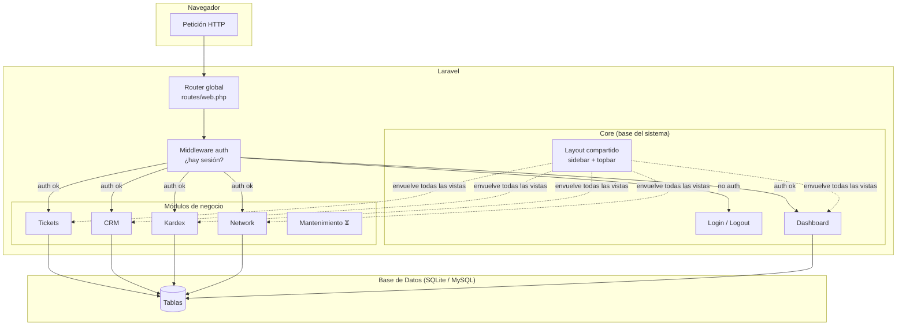
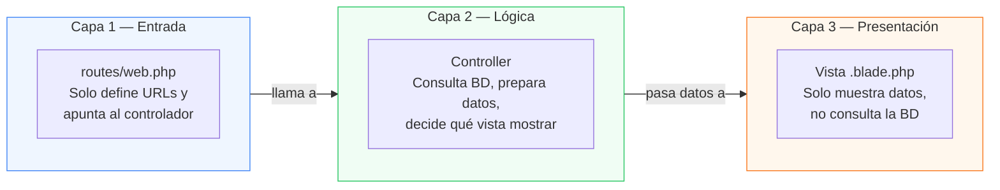
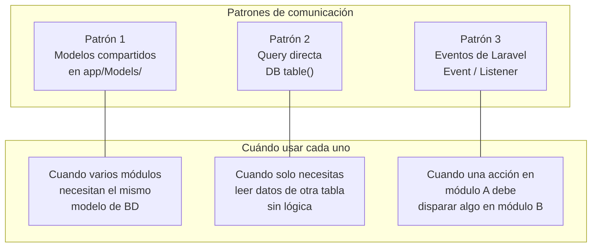
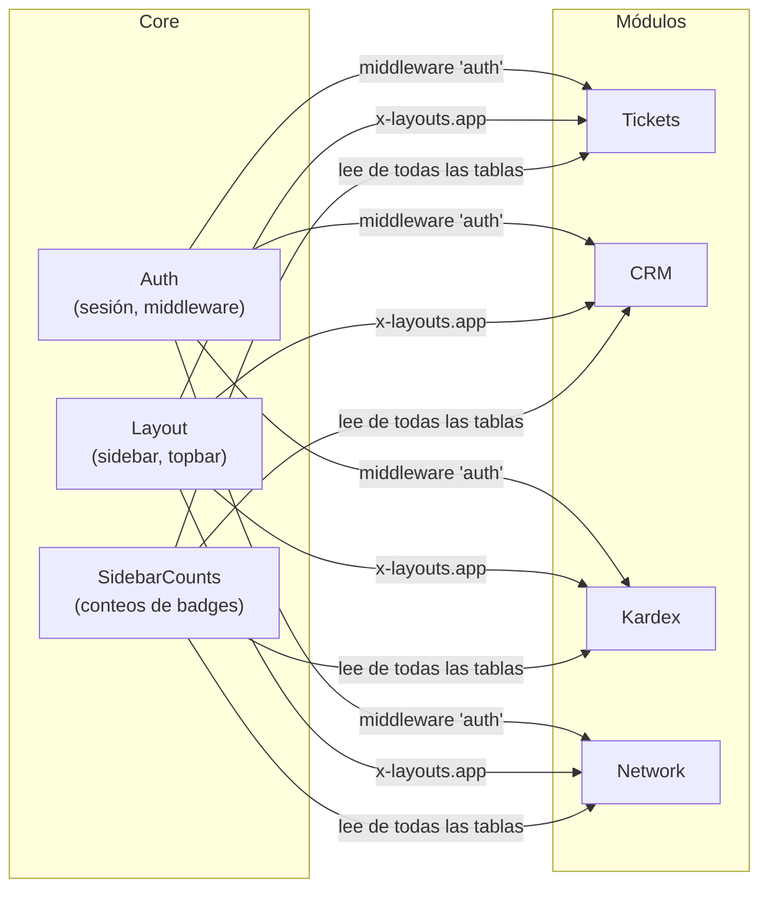
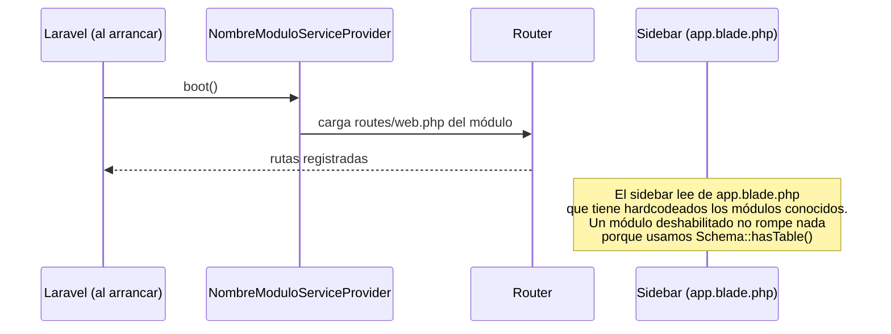
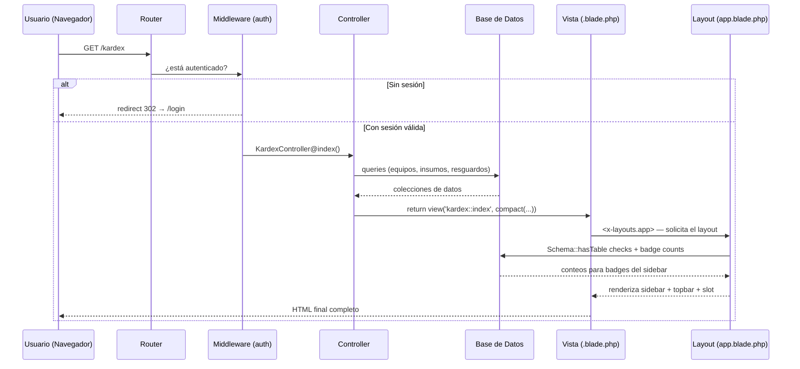

# Arquitectura del Sistema — IMJUnificado

Este documento explica cómo está estructurado el código, cómo se comunican los módulos entre sí y cuáles son las reglas que hay que seguir para no crear caos cuando el proyecto crezca.

---

## 1. Vista General del Sistema



---

## 2. Las Capas del Sistema

El código tiene tres capas. Cada capa tiene una responsabilidad y nunca la viola:



**Regla de oro: la información solo fluye hacia abajo. La vista nunca habla con la base de datos. Las rutas nunca tienen lógica de negocio.**

---

## 3. Anatomía de un Módulo

Cada módulo tiene exactamente la misma estructura. No hay excepciones.

```
Modules/NombreModulo/
│
├── app/
│   ├── Http/Controllers/
│   │   └── NombreModuloController.php   ← TODA la lógica vive aquí
│   ├── Models/
│   │   └── MiModelo.php                 ← Solo si el modelo es EXCLUSIVO de este módulo
│   └── Providers/
│       ├── NombreModuloServiceProvider.php   ← Laravel lo usa para activar el módulo
│       └── RouteServiceProvider.php          ← Registra las rutas del módulo
│
├── database/
│   ├── migrations/                      ← Tablas que "pertenecen" a este módulo
│   └── seeders/                         ← Datos iniciales (si aplica)
│
├── resources/
│   └── views/
│       ├── index.blade.php              ← Vista principal
│       ├── create.blade.php             ← Formulario de creación
│       └── show.blade.php               ← Vista de detalle
│
├── routes/
│   └── web.php                          ← Solo define rutas, nada más
│
└── module.json                          ← Metadatos del módulo (nombre, alias, estado)
```

---

## 4. Cómo se Comunican los Módulos

Esta es la parte más importante. Los módulos **no se hablan directamente** — eso crearía dependencias que hacen imposible activar o desactivar un módulo sin romper los demás.

Hay tres patrones aprobados, según el caso:



### Patrón 1 — Modelos compartidos en `app/Models/`

Si dos o más módulos necesitan el mismo dato, el modelo vive en `app/` (el espacio global), no dentro de un módulo.

```
app/
└── Models/
    ├── User.php      ← usado por Core + cualquier módulo que necesite al técnico
    └── Empleado.php  ← DEBERÍA estar aquí (lo usan CRM, Tickets, Kardex, Network)
```

```php
// ✅ CORRECTO — importar desde app/Models/
use App\Models\Empleado;

// ❌ MAL — importar desde otro módulo (crea dependencia dura)
use Modules\CRM\Models\Empleado;
```

### Patrón 2 — Query directa con `DB::table()`

Cuando un módulo necesita leer datos que "pertenecen" a otro módulo pero no necesita lógica del modelo, usa la query directa. Es simple y no crea dependencias.

```php
// En TicketsController — necesito el nombre del empleado por su correo
// No importo nada de CRM — solo hablo con la tabla directamente
$empleado = DB::table('empleados')
    ->where('correo', $correo)
    ->first();
```

### Patrón 3 — Eventos (para efectos secundarios)

Cuando una acción en un módulo debe **disparar** algo en otro módulo, se usa el sistema de eventos de Laravel. El módulo emisor no sabe ni le importa quién escucha.

```php
// En TicketsController — al crear un ticket, disparo un evento
use App\Events\TicketCreado;

Ticket::create([...]);
event(new TicketCreado($ticket));   // el emisor no sabe qué pasa después
```

```php
// En un Listener (puede estar en cualquier módulo)
// Este listener podría enviar un email, actualizar un contador, etc.
class NotificarTecnicosListener
{
    public function handle(TicketCreado $event): void
    {
        // Lógica de notificación aquí
    }
}
```

> **Nota:** Los eventos aún no están implementados en este proyecto. Cuando se implemente notificación por email o alguna integración entre módulos, este es el patrón a seguir.

---

## 5. Core → Módulos: Los Servicios que Core Provee

El módulo Core es el único que puede hablar directamente con todos los demás. Provee tres cosas:



#### Auth

El middleware `auth` de Core protege automáticamente cualquier ruta que lo declare:

```php
// En cualquier routes/web.php de cualquier módulo
Route::middleware(['auth'])->group(function () {
    // Si no hay sesión, Laravel redirige a /login automáticamente
});
```

#### Layout

Cualquier vista del sistema usa el layout de Core con una sola línea:

```blade
<x-layouts.app title="Mi Módulo">
    {{-- contenido --}}
</x-layouts.app>
```

#### SidebarCounts (el patrón de badges)

El sidebar muestra conteos en tiempo real (ej: tickets abiertos). El problema: si el módulo Tickets no está migrado, la query fallará y romperá toda la app.

**Patrón aprobado — usar `Schema::hasTable()` como guardia:**

```php
// En app.blade.php (layout de Core) — antes de cualquier query de módulo
@php
    $ticketsAbiertos = Schema::hasTable('tickets')
        ? DB::table('tickets')->where('estado', 0)->count()
        : 0;
@endphp

@if($ticketsAbiertos > 0)
    <span class="badge">{{ $ticketsAbiertos }}</span>
@endif
```

Esto garantiza que el layout funcione aunque el módulo de Tickets no esté instalado.

---

## 6. Módulo → Core: Cómo un Módulo se Registra

Un módulo le "dice" a Core que existe a través de su `ServiceProvider`. Esto ocurre automáticamente cuando el módulo está habilitado.



**Regla:** cuando agregues un módulo nuevo, debes hacer dos cosas manualmente:
1. Agregar su link en el sidebar de `resources/views/components/layouts/app.blade.php`
2. Agregar su badge (si aplica) usando el patrón `Schema::hasTable()` arriba descrito

---

## 7. El Flujo Completo de una Petición

Desde que el usuario hace click hasta que ve la página:



---

## 8. Módulos Activos, Inactivos y Placeholders

Un módulo puede estar en tres estados:

| Estado | Qué significa | Cómo se ve en código |
|---|---|---|
| ✅ Activo | Tiene rutas, controlador y vistas funcionales | `module.json` → `"status": 1` |
| ⏳ Placeholder | Existe el scaffolding pero sin funcionalidad | Vista con mensaje "en construcción" |
| ❌ Deshabilitado | No carga sus rutas ni vistas | `php artisan module:disable NombreModulo` |

### Patrón para módulo placeholder

Cuando un módulo existe pero aún no está implementado, usa esta vista estándar:

```blade
<x-layouts.app title="Nombre — IMJUVE CRM">
<div class="p-8 flex items-center justify-center h-96">
    <div class="text-center text-[#544246]">
        <span class="material-symbols-outlined text-5xl block mb-3">construction</span>
        <h3 class="text-xl font-bold text-[#621132] mb-1">Módulo en construcción</h3>
        <p class="text-sm">Este módulo estará disponible próximamente.</p>
    </div>
</div>
</x-layouts.app>
```

### Patrón para el sidebar cuando un módulo puede estar inactivo

```blade
{{-- En app.blade.php — el link siempre aparece, el badge es defensivo --}}
<a href="{{ route('telefonos.index') }}" class="...">
    <span class="material-symbols-outlined">phone</span>
    Teléfonos
    @php
        $extCount = Schema::hasTable('telefonos')
            ? DB::table('telefonos')->count()
            : 0;
    @endphp
    @if($extCount > 0)
        <span class="ml-auto badge">{{ $extCount }}</span>
    @endif
</a>
```

---

## 9. Cómo Agregar un Módulo Nuevo

Pasos obligatorios, en orden:

### Paso 1 — Generar el andamiaje

```bash
php artisan module:make NuevoModulo
```

Esto crea toda la estructura de carpetas automáticamente.

### Paso 2 — Definir la ruta en `Modules/NuevoModulo/routes/web.php`

```php
<?php
use Illuminate\Support\Facades\Route;
use Modules\NuevoModulo\Http\Controllers\NuevoModuloController;

Route::middleware(['auth'])->prefix('nuevo')->name('nuevo.')->group(function () {
    Route::get('/',       [NuevoModuloController::class, 'index'])->name('index');
    Route::get('/create', [NuevoModuloController::class, 'create'])->name('create');
    Route::post('/',      [NuevoModuloController::class, 'store'])->name('store');
});
```

### Paso 3 — Implementar el controlador

```php
// Modules/NuevoModulo/app/Http/Controllers/NuevoModuloController.php
class NuevoModuloController extends Controller
{
    public function index()
    {
        $datos = DB::table('mi_tabla')->get();
        return view('nuevomodulo::index', compact('datos'));
    }
}
```

### Paso 4 — Crear la vista principal

```blade
{{-- Modules/NuevoModulo/resources/views/index.blade.php --}}
<x-layouts.app title="Nuevo Módulo — IMJUVE CRM">
<div class="p-8">
    <h2 class="text-[32px] font-bold text-[#621132]">Nombre del Módulo</h2>
    {{-- contenido --}}
</div>
</x-layouts.app>
```

### Paso 5 — Agregar al sidebar en `resources/views/components/layouts/app.blade.php`

```blade
<a href="{{ route('nuevo.index') }}"
   class="flex items-center gap-3 px-4 py-3 rounded text-sm transition-colors
          {{ request()->routeIs('nuevo.*')
             ? 'text-[#621132] font-bold border-r-4 border-[#621132] bg-[#eae8e7]'
             : 'text-[#544246] hover:bg-[#F3F4F6]' }}">
    <span class="material-symbols-outlined">icono_aqui</span>
    Nombre del Módulo
</a>
```

### Paso 6 — Crear la migración (si necesitas tablas nuevas)

```bash
php artisan module:make-migration create_mi_tabla_table NuevoModulo
php artisan migrate
```

---

## 10. Omnibuscador Global

La barra de búsqueda del topbar busca simultáneamente en los 4 módulos principales. El flujo es completamente server-side: no hay AJAX, no hay dropdown flotante.

### Flujo

```
Usuario escribe → Enter → GET /dashboard?q=término
                                  ↓
                    Dashboard route corre 4 queries en paralelo
                    (empleados, inventario, red, tickets)
                                  ↓
                    $searchResults = [ { modulo, icon, total, items[] } ]
                                  ↓
                    dashboard.blade.php renderiza panel a ancho completo
                    con columnas por módulo (una por cada grupo con resultados)
```

### Dónde vive el código

| Archivo | Qué hace |
|---|---|
| `resources/views/components/layouts/app.blade.php` | Form GET en el topbar; función `submitSearch()` |
| `Modules/Core/routes/web.php` → ruta `/dashboard` | Corre las 4 búsquedas, pasa `$searchResults` a la vista |
| `Modules/Core/resources/views/dashboard.blade.php` | Renderiza el panel cuando `$searchResults !== null` |

### Campos que se buscan por módulo

| Módulo | Campos |
|---|---|
| **Empleados** | nombre, apellidos, puesto, correo, nombre del departamento (JOIN), extensión telefónica (JOIN) |
| **Inventario** | nombre_usuario, nombre_equipo, área, marca/modelo/serie de CPU, monitor, teclado, mouse, nobreak, cargador, docking, IPv4, MAC, num_inventario |
| **Red e IPs** | ip, usuario, area_excel, departamento_pestana, tipo_equipo, MAC |
| **Tickets** | descripción, tipo, área, nombre del solicitante, correo |

### Añadir un módulo nuevo a la búsqueda

1. Agregar un bloque `// Nombre del módulo` en la ruta `/dashboard` de `Core/routes/web.php`, siguiendo el mismo patrón: `$cond → $total → if ($total > 0) → $groups[]`.
2. Asegurarse de que la URL del item incluya `?open=ID` para activar el deep-link.
3. Si la tabla puede no existir en algunos entornos, envolver en `if (\Schema::hasTable('tabla'))`.

### Compatibilidad SQLite / MySQL

Todas las queries del omnibuscador usan solo sintaxis estándar SQL compatible con ambos motores:
- `LOWER(COALESCE(campo,'')) LIKE LOWER(?)` — funciona en SQLite y MySQL
- `campo LIKE ?` en columnas de texto — funciona en ambos (no usar `CAST(... AS TEXT)`, eso es SQLite-only)
- Para columnas enteras (`extension`), usar `campo LIKE ?` directamente — ambos motores coercionan INT → string para LIKE

---

## 11. Deep-links desde la Búsqueda

Cada resultado del omnibuscador lleva una URL con `?open=ID` que, al cargar la página del módulo, abre automáticamente el panel lateral del elemento exacto.

### Cómo funciona por módulo

| Módulo | URL | Mecanismo |
|---|---|---|
| CRM | `/crm?open={id_empleado}` | Busca `tr[data-id="X"]` y llama `openUserPanel(row)` |
| Kardex | `/kardex?open={id}` | Llama `abrirPanelEquipo(id)` directamente |
| Tickets | `/tickets?open={id}` | Busca `[data-ticket-id="X"]` y llama `openPanel(el)` |
| Network | `/network?open={ip}` | Busca `tr[data-ip="X"]`, hace scroll y llama `.click()` |

### Snippet estándar (copiar al final del `<script>` de cada módulo)

```js
// Deep-link: ?open=ID abre el panel del elemento directamente
(function () {
    const id = new URLSearchParams(location.search).get('open');
    if (!id) return;
    // CRM:     const row = document.querySelector(`tr[data-id="${id}"]`); if (row) openUserPanel(row);
    // Kardex:  abrirPanelEquipo(parseInt(id));
    // Tickets: const el = document.querySelector(`[data-ticket-id="${id}"]`); if (el) openPanel(el);
    // Network: const row = document.querySelector(`tr[data-ip="${id}"]`); if (row) { row.scrollIntoView({block:'center'}); row.click(); }
})();
```

Para que Network funcione, cada `<tr>` de la tabla de IPs debe tener `data-ip="{{ $ip->ip }}"`.

---

## 12. Reglas que No Se Rompen

| # | Regla | Razón |
|---|---|---|
| 1 | **Un módulo nunca importa clases de otro módulo** | Si el módulo B no está instalado, el módulo A se rompe |
| 2 | **Las vistas nunca consultan la BD** | Viola MVC, imposible de probar, mezcla responsabilidades |
| 3 | **Las rutas nunca tienen lógica** | La lógica en rutas no es reutilizable ni testeable |
| 4 | **Los modelos compartidos van en `app/Models/`** | Un modelo en `Modules/X/` no puede ser usado por `Modules/Y/` |
| 5 | **El layout solo se toca en `resources/views/components/layouts/app.blade.php`** | Cada módulo con su propio layout = inconsistencia visual |
| 6 | **Los badges del sidebar usan `Schema::hasTable()`** | Sin esto, un módulo sin migrar rompe toda la app |
| 7 | **Las migraciones se nombran con timestamp ordenado** | Las FKs necesitan que la tabla padre exista primero |
