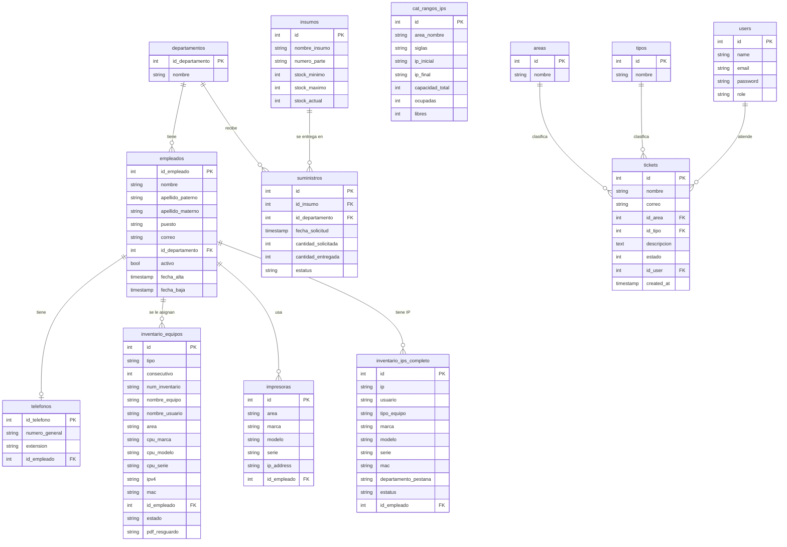
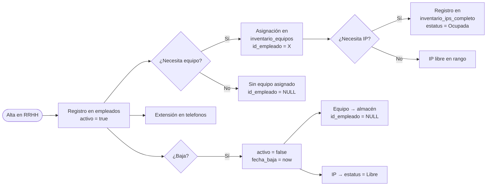
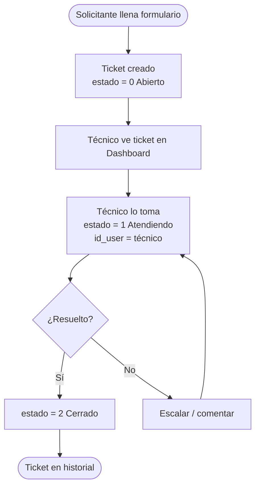
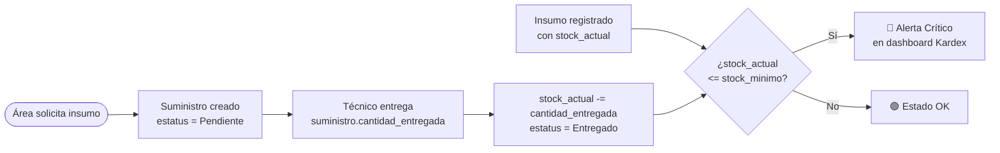

# Base de Datos — Modelo de Datos, Flujo y Ciclo de Vida

---

## Diagrama del modelo de datos (Entidad-Relación)



> **Cómo renderizar este diagrama:** cualquier editor que soporte Mermaid (GitHub, GitLab, Obsidian, VS Code con extensión Mermaid Preview) renderiza el bloque anterior como un diagrama visual. En GitHub se ve automáticamente al abrir el archivo.

---

## Tablas en detalle

### `departamentos`
Las 18 áreas/direcciones del instituto. Son el catálogo base del que dependen empleados, equipos e insumos.

| Campo | Tipo | Descripción |
|---|---|---|
| `id_departamento` | PK | Auto-incremental |
| `nombre` | string(120) | Nombre completo del área. Único. |

**Datos actuales:** 18 departamentos cargados del `directorio_imjuve.xlsx`.

---

### `empleados`
El directorio institucional. Cada persona que trabaja en el instituto.

| Campo | Tipo | Descripción |
|---|---|---|
| `id_empleado` | PK | Auto-incremental |
| `nombre` | string(80) | Nombre(s) |
| `apellido_paterno` | string(80) | Apellido paterno |
| `apellido_materno` | string(80) | Apellido materno |
| `puesto` | string(120) | Cargo institucional |
| `correo` | string(120) | Correo institucional (generado como `nombre.apellido@imjuve.gob.mx`) |
| `id_departamento` | FK | Área a la que pertenece. NULL si no tiene área asignada |
| `activo` | bool | `true` = en activo, `false` = baja |
| `fecha_alta` | timestamp | Cuándo fue dado de alta en el sistema |
| `fecha_baja` | timestamp | Cuándo fue dado de baja (null si activo) |

**Datos actuales:** 19 empleados del `directorio_imjuve.xlsx`.

> **Nota de diseño:** esta tabla fusiona lo que eran dos tablas separadas en los sistemas originales: `usuarios` del sistema de inventario y `empleados` del sistema de tickets. Eran el mismo dato con diferente nombre.

---

### `telefonos`
Una extensión telefónica por empleado.

| Campo | Tipo | Descripción |
|---|---|---|
| `id_telefono` | PK | Auto-incremental |
| `numero_general` | string | Número central de la institución |
| `extension` | string | Extensión interna (ej. `"3215"`) |
| `id_empleado` | FK | Empleado al que pertenece. NULL si es línea compartida |

---

### `inventario_equipos`
Todos los equipos de cómputo asignados o en almacén.

| Campo | Tipo | Descripción |
|---|---|---|
| `tipo` | string | `'Laptop'`, `'PC Avanzada'` o `'PC Especializada'` |
| `num_inventario` | string | Número de inventario institucional (ej. `"SEJUV-2024-0045"`) |
| `nombre_equipo` | string | Hostname del equipo |
| `nombre_usuario` | string | Nombre del usuario asignado (texto libre del Excel original) |
| `area` | string | Área donde está físicamente |
| `cpu_marca` / `cpu_modelo` | string | Fabricante y referencia del equipo |
| `cpu_serie` | string | **Número de serie del fabricante** — clave para vincular con `inventario_ips_completo.serie` |
| `cargador/docking_*` | string | Series de accesorios de laptop |
| `monitor/teclado/mouse/nobreak_*` | string | Series de periféricos de PC |
| `ipv4` | string | IP asignada — poblada desde `inventario_ips_completo.ip` via `serie = cpu_serie` |
| `mac` | string | Dirección MAC |
| `id_empleado` | FK | Empleado al que está asignado. Poblado por migración de datos desde `nombre_usuario`. NULL = en almacén o sin match |
| `estado` | string nullable | `null`=derivado, `'mantenimiento'`, `'baja'` |
| `pdf_resguardo` | string | Ruta relativa dentro de `storage/app/` al PDF de resguardo |

**Datos actuales:** 180 equipos. **110 tienen `id_empleado` poblado** (vinculados por nombre en la migración `2026_07_09_000002`); 70 en almacén o sin match de nombre. **19 tienen `ipv4` poblada** desde `inventario_ips_completo`.

> **Nota:** los FK `id_empleado` en `inventario_equipos` estaban vacíos en la BD original (sistemitas.sql). La migración `2026_07_09_000002` los pobló haciendo `mb_strtolower(nombre_usuario)` contra `empleados.(nombre + apellido_paterno)`. El campo `nombre_usuario` sigue siendo el texto original como respaldo.

---

### `impresoras`

| Campo | Tipo | Descripción |
|---|---|---|
| `area` | string | Área donde está la impresora |
| `marca` / `modelo` | string | Identificación del equipo |
| `firmware` | string | Versión de firmware instalada |
| `serie` | string | Número de serie físico |
| `ip_address` | string(45) | IP asignada (cubre IPv4 e IPv6) |
| `id_empleado` | FK | Responsable de la impresora |

**Datos actuales:** 10 impresoras del `SOLICITUDES TONER Y STOCK.xlsx`.

---

### `insumos` y `suministros`

`insumos`: catálogo de consumibles (toners, cartuchos, etc.)

| Campo | Tipo | Descripción |
|---|---|---|
| `nombre_insumo` | string | Descripción del insumo |
| `numero_parte` | string | Part number del fabricante |
| `stock_minimo` | int | Cantidad mínima aceptable |
| `stock_maximo` | int | Capacidad máxima de almacén |
| `stock_actual` | int | Piezas disponibles ahora mismo |

`suministros`: registro de cada entrega a un área.

| Campo | Tipo | Descripción |
|---|---|---|
| `id_insumo` | FK | Qué insumo se entregó |
| `id_departamento` | FK | A qué área se entregó |
| `fecha_solicitud` | timestamp | Cuándo se solicitó |
| `cantidad_solicitada` | int | Piezas pedidas |
| `cantidad_entregada` | int | Piezas realmente entregadas |
| `estatus` | string | `'Pendiente'`, `'Entregado'`, `'Cancelado'` |

**Datos actuales:** 8 insumos del `SOLICITUDES TONER Y STOCK.xlsx`.

---

### `cat_rangos_ips` e `inventario_ips_completo`

`cat_rangos_ips`: los 11 rangos de red, uno por área institucional.

| Campo | Tipo | Descripción |
|---|---|---|
| `area_nombre` | string | Nombre completo del área |
| `siglas` | string | Sigla del área (DG, DBEJ, SS, etc.) |
| `ip_inicial` / `ip_final` | string | Extremos del rango |
| `capacidad_total` | int | IPs disponibles en el rango |
| `ocupadas` / `libres` | int | Estado del rango |

`inventario_ips_completo`: registro individual de cada IP.

| Campo | Tipo | Descripción |
|---|---|---|
| `ip` | string(45) UNIQUE | Dirección IP (índice único) |
| `usuario` | string | Login del usuario que la usa (texto del Excel, ej: `grivera`, `ELAP-JALOPEZ`) |
| `tipo_equipo` | string | `LAP`, `lap`, `PC`, `pc`, `PCA`, `TABLET`, `CEL`, `IMPRESORA`, etc. |
| `institucional_o_personal` | string | Si el equipo es del instituto o personal |
| `serie` | string | **Número de serie del equipo** — se une con `inventario_equipos.cpu_serie` para vincular IP↔equipo |
| `mac` | string | Dirección MAC del dispositivo |
| `tipo_conexion` | string | Cableado / WiFi |
| `config_red` | string | DHCP / Estática |
| `departamento_pestana` | string | Siglas del área (DG, DBEJ, etc.) |
| `restricciones` | string | Restricciones de acceso especiales |
| `youtube` / `facebook` / ... | string(10) | Permisos de acceso a servicios web por IP |
| `estatus` | string | `'Ocupada'`, `'Libre'`, `'Reservada'` |
| `id_empleado` | FK nullable | Poblado por migración `2026_07_09_000002` via la cadena `serie → inventario_equipos.cpu_serie → id_empleado` |

**Datos actuales:** 11 rangos, 490 IPs en 11 áreas. **17 tienen `id_empleado` poblado.**

> **Cómo vincular IP con equipo:** el campo `serie` en esta tabla corresponde al número de serie físico del equipo. El join correcto es `LOWER(TRIM(inventario_ips_completo.serie)) = LOWER(TRIM(inventario_equipos.cpu_serie))` — necesario el LOWER/TRIM porque el Excel original tenía inconsistencias de mayúsculas y espacios. Los endpoints de CRM y Kardex usan esto como subquery COALESCE para devolver la IP real en tiempo de consulta.

---

### `users` (técnicos del sistema)

| Campo | Tipo | Descripción |
|---|---|---|
| `name` | string | Nombre del técnico |
| `email` | string UNIQUE | Correo de acceso al sistema |
| `password` | string | Hash bcrypt de la contraseña |
| `role` | string(20) | `'admin'` o `'tecnico'` |

> Esta tabla es para los **técnicos de TI** que operan el sistema, no para el personal institucional (esos son `empleados`).

---

### `tickets`, `areas`, `tipos`

`areas` y `tipos` son catálogos simples con solo `id` y `nombre`.

`tickets`:

| Campo | Tipo | Descripción |
|---|---|---|
| `nombre` | string | Nombre del solicitante |
| `correo` | string | Correo del solicitante |
| `id_area` | FK → areas | Área desde donde se genera |
| `id_tipo` | FK → tipos | Tipo de incidente |
| `descripcion` | text | Detalle del problema |
| `estado` | int | `0`=Abierto, `1`=Atendiendo, `2`=Cerrado |
| `id_user` | FK → users | Técnico asignado |

---

## Flujo de datos — Ciclo de vida

### Ciclo de vida de un empleado



### Ciclo de vida de un ticket



### Ciclo de vida de un insumo



---

## Relaciones clave explicadas

### Empleado ↔ Equipo
`inventario_equipos.id_empleado` es FK simple (un equipo → un empleado). Un empleado puede tener N equipos — aparece en N filas. No hay tabla intermedia porque la asignación institucional es directa.

**Estado actual de los datos:** los FK estaban vacíos en el dump original. La migración `2026_07_09_000002` / paso 3 de `app:boot` los pobló comparando `nombre_usuario` contra `empleados.(nombre + apellido_paterno)` con `mb_strtolower` + `str_contains`. 110 de 180 equipos quedaron vinculados. Los 70 restantes no tienen nombre en el Excel o el nombre no coincide exactamente.

### Equipo ↔ IP (la relación real)
La IP de un equipo NO está en `inventario_equipos.ipv4` directamente en el dump original — ese campo estaba vacío. La IP real está en `inventario_ips_completo.ip` y se vincula por:

```sql
LOWER(TRIM(inventario_ips_completo.serie)) = LOWER(TRIM(inventario_equipos.cpu_serie))
```

Este join devuelve 19 coincidencias (de 180 equipos). El LOWER/TRIM es necesario porque el Excel original tenía inconsistencias de capitalización y espacios.

En los endpoints de CRM y Kardex se usa COALESCE en tiempo de consulta:
```sql
COALESCE(
    NULLIF(TRIM(inventario_equipos.ipv4), ''),
    (SELECT ips.ip FROM inventario_ips_completo ips
     WHERE LOWER(TRIM(ips.serie)) = LOWER(TRIM(inventario_equipos.cpu_serie))
     LIMIT 1)
) as ipv4_real
```

### Empleado ↔ IP
`inventario_ips_completo.id_empleado` puede ser NULL (IP libre) o apuntar a un empleado. Se pobló vía la cadena: `inventario_ips_completo.serie → inventario_equipos.cpu_serie → inventario_equipos.id_empleado`. 17 registros de IP quedaron vinculados.

### Tickets ↔ Empleados (relación pendiente)
Los tickets guardan nombre y correo como texto libre (herencia de IMJTickets). La siguiente mejora es agregar `id_empleado FK` a `tickets` para conectar el historial de soporte al perfil del empleado en CRM.

---

## Migraciones — orden de ejecución

```
0001_01_01_000000  → users (Laravel base)
0001_01_01_000001  → cache
0001_01_01_000002  → jobs
2025_01_01_000000  → users (columna role)
2025_01_01_000001  → departamentos
2025_01_01_000002  → empleados              (FK → departamentos)
2025_01_01_000003  → telefonos              (FK → empleados)
2025_01_01_000004  → inventario_equipos     (FK → empleados)
2025_01_01_000005  → impresoras             (FK → empleados)
2025_01_01_000006  → insumos + suministros  (FK → insumos, departamentos)
2025_01_01_000007  → cat_rangos_ips + inventario_ips_completo (FK → empleados)
2025_01_01_000010  → tickets + areas + tipos (FK → users)
2026_07_09_000001  → inventario_equipos: agrega columna estado (nullable)
2026_07_09_000002  → migración de datos (ver nota abajo)
```

> **Nota sobre `2026_07_09_000002`:** esta migración vincula FKs e IPs, pero depende de que los datos ya estén importados. Si se corre `migrate` en tablas vacías, no hace nada (sus WHERE incluyen `whereNull` y `EXISTS`). La lógica real se ejecuta dentro de `app:boot` justo después de importar los datos. **No es necesario correrla manualmente.**

Comandos habituales:

```bash
# Crear tablas (sin datos)
php artisan migrate

# Resetear BD completa y recrear
php artisan migrate:fresh

# Importar datos desde los respaldos legados (incluye vinculación de FKs)
php artisan app:boot --force

# Todo desde cero (setup limpio)
php artisan migrate:fresh --force && php artisan db:seed && php artisan app:boot --force
```

---

## Origen de los datos

Los datos vienen del comando `app:boot` que lee `DB_source/sistemitas.sql` (dump PostgreSQL del sistema de inventario original):

| Tabla destino | Origen en sistemitas.sql | Registros |
|---|---|---|
| `departamentos` | tabla `departamentos` | 19 |
| `empleados` | tabla `usuarios` | 127 |
| `telefonos` | tabla `telefonos` | 19 |
| `inventario_equipos` | tabla `inventario_equipos` | 180 |
| `impresoras` | tabla `impresoras` | 11 |
| `insumos` | tabla `insumos` | 3 |
| `suministros` | tabla `suministros` | 4 |
| `cat_rangos_ips` | tabla `cat_rangos_ips` | 11 |
| `inventario_ips_completo` | tabla `inventario_ips_completo` | 490 |

El seeder `db:seed` solo crea: usuario admin, catálogo de áreas y tipos de ticket.

> Si el dump `sistemitas.sql` se actualiza, ejecuta `php artisan app:boot --force` para reimportar todo.
