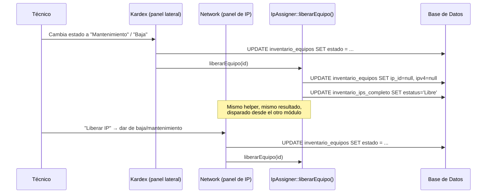

# Estados del equipo, liberación de IP y baja de usuario

Documenta tres piezas relacionadas, implementadas en la misma sesión de
trabajo:

1. Qué le pasa a la IP de un equipo cuando cambia su estado (Kardex y
   Network comparten la misma lógica).
2. El estado **Almacén** como acción explícita (no solo un cálculo).
3. Qué le pasa a los equipos de una persona cuando se le da de baja en CRM.

---

## 1. Estados de `inventario_equipos`

La columna `inventario_equipos.estado` solo guarda tres valores posibles:
`null`, `'mantenimiento'` o `'baja'`. Todo lo demás (Asignado / Almacén) se
**calcula**, no se guarda, comparando `estado` con si el equipo tiene
`user_id`:

```php
$estadoDisplay = match(true) {
    $eq->estado === 'mantenimiento' => 'Mantenimiento',
    $eq->estado === 'baja'          => 'Baja',
    !is_null($eq->user_id)          => 'Asignado',
    default                         => 'Almacén',
};
```

Esta lógica vive duplicada (a propósito, son vistas distintas) en:
`Modules/Kardex/resources/views/index.blade.php` (pestañas Equipos y
Resguardos) y en el JS del panel lateral (`abrirPanelEquipo`).

### Qué dispara cada estado y qué le pasa a la IP / al responsable

El panel lateral de un equipo (`{{-- ══ Panel lateral: Detalle de equipo
══ --}}` en Kardex) tiene un selector con 4 opciones. Todas postean a
`POST /kardex/equipo/{id}/estado`, manejado por
`KardexController::cambiarEstadoEquipo()`:

| Opción del selector | `estado` guardado | `user_id` / `usuario_actual_id` | IP (`ip_id` / `ipv4`) |
|---|---|---|---|
| **Automático** | `null` | sin cambios | sin cambios |
| **Regresar a Almacén** | `null` | se limpian (desvincula al responsable) | **se conserva** |
| **Mantenimiento** | `'mantenimiento'` | sin cambios | se libera (`IpAssigner::liberarEquipo()`) |
| **Baja** | `'baja'` | sin cambios | se libera (`IpAssigner::liberarEquipo()`) |

La diferencia clave entre **Almacén** y **Mantenimiento/Baja** es esa
última columna: Almacén asume que el equipo sigue en la misma ubicación de
red (solo cambió de responsable, por ejemplo alguien que dejó el puesto
pero el equipo se queda en la oficina), así que no tiene sentido liberar
la IP. Mantenimiento/Baja sí liberan la IP porque el equipo deja de estar
en uso activo en la red.

### El helper compartido: `IpAssigner::liberarEquipo()`

```php
// app/Support/IpAssigner.php
public static function liberarEquipo(int $equipoId): void
{
    $eq = DB::table('inventario_equipos')->where('id', $equipoId)->first();
    if (!$eq || !$eq->ip_id) return;

    DB::table('inventario_equipos')->where('id', $equipoId)->update([
        'ip_id' => null, 'ipv4' => null, 'updated_at' => now(),
    ]);
    DB::table('inventario_ips_completo')->where('id', $eq->ip_id)->update([
        'estatus' => 'Libre', 'updated_at' => now(),
    ]);
}
```

Este método es la **única fuente de verdad** para "liberar la IP de un
equipo". Antes de esta sesión, `NetworkController::liberarPorEstado()`
tenía la misma lógica duplicada inline; ahora ambos módulos llaman al
mismo helper:

- `Modules/Kardex/app/Http/Controllers/KardexController.php` →
  `cambiarEstadoEquipo()`
- `Modules/Network/app/Http/Controllers/NetworkController.php` →
  `liberarPorEstado()` (rama `inventario_equipos`; la rama `impresoras`
  sigue con su propia lógica inline porque `impresoras` no tiene columna
  de estado y el helper es específico de `inventario_equipos`)



---

## 2. Sincronización en vivo de las tablas de Kardex

Al guardar un cambio de estado desde el panel lateral, el JS actualiza sin
recargar la página:

- El badge de Estado en la fila de la pestaña **Equipos** (`#estado-badge-{id}`)
- El badge de Estado en la fila de la pestaña **Resguardos**
  (`#estado-badge-rsg-{id}`) — ambas pestañas muestran el mismo equipo, con
  el mismo estado real
- La celda de Responsable (`#responsable-cell-{id}` /
  `#responsable-cell-rsg-{id}`), que pasa a "—" cuando la acción fue
  "Regresar a Almacén"
- Si el cambio fue a Mantenimiento, Baja o Almacén, el panel se vuelve a
  pedir al servidor (`abrirPanelEquipo(id)`) para reflejar el estado real
  que quedó guardado (por ejemplo, la IP ya liberada)

---

## 3. Pestaña Resguardos — ahora sí es "resguardos"

Antes, la pestaña Resguardos mostraba **todos** los equipos con una
columna/filtro "PDF" (Con/Sin PDF). Eso no tenía mucho sentido: si la
pestaña se llama Resguardos, debería mostrar los resguardos, no el
inventario completo otra vez.

Ahora:

- `KardexController::index()` calcula
  `$resguardos = $equipos->filter(fn($e) => !empty($e->pdf_resguardo))->values();`
  y la pestaña itera sobre `$resguardos`, no sobre `$equipos`. El punto de
  identidad sigue siendo `cpu_serie` del equipo — no hay una tabla
  "resguardos" separada, son las mismas filas de `inventario_equipos`
  filtradas.
- El filtro/columna "PDF" se reemplazó por "Estado" (mismas 4 opciones que
  la pestaña Equipos: Almacén/Asignado/Mantenimiento/Baja), porque una vez
  que la pestaña solo muestra equipos con PDF, "Con/Sin PDF" deja de
  aportar información (siempre sería "Con PDF").
- La descarga del PDF individual sigue disponible desde el panel lateral
  de detalle del equipo (`/kardex/equipo/{id}/pdf`), no cambió.

---

## 4. Pestaña Impresoras — detalle + enlace a la IP

La pestaña Impresoras (antes solo lectura, sin ninguna interacción) ahora
tiene filas clicables que abren un modal de detalle
(`#modal-impresora-detalle`) con Área, Marca/Modelo, Serie, Responsable, y
la **IP como hipervínculo**:

```html
<a href="{{ route('network.index') }}?open=172.17.1.213" target="_blank">
    172.17.1.213
</a>
```

Ese enlace reutiliza el deep-link que ya existía en el módulo Network
(`?open={ip}` — busca la fila `tr[data-ip="..."]` en `/network` y la abre
automáticamente). Abre en pestaña nueva para no perder el contexto de
Kardex.

---

## 5. Baja de usuario (CRM) — efecto en cascada

`Modules/CRM/resources/views/index.blade.php` tiene un botón "Dar de
Baja" dentro del modal de edición de usuario (`#section-baja`). Dos
cambios en esta sesión:

### 5.1 Visibilidad — solo administradores

```blade
@if(auth()->user()->isAdmin())
<div id="section-baja" class="hidden border-t border-border pt-4">
    ...
</div>
@endif
```

En la práctica, **toda la ruta `/crm` ya requería el middleware `admin`**
(`Route::middleware(['auth', 'admin'])->prefix('crm')` en
`Modules/CRM/routes/web.php`), así que ningún usuario `role=user` podía
llegar aquí de todos modos. Este `@if` es un refuerzo explícito a nivel de
vista, no un cambio de quién puede dar de baja en la práctica.

### 5.2 Qué pasa al confirmar "Dar de Baja"

`CRMController::destroy($id)` — antes solo marcaba `activo = false`. Ahora
también:

```mermaid
flowchart TD
    A([Admin confirma "Dar de Baja"]) --> B[activo = false, fecha_baja = now]
    B --> C[password = hash aleatorio nuevo]
    C --> D[recovery_code_hash = null]
    D --> E[Todos los inventario_equipos donde\nuser_id o usuario_actual_id = este usuario]
    E --> F[user_id = null, usuario_actual_id = null,\nestado = null → equipo pasa a Almacén]
    F --> G[La IP de esos equipos NO se toca —\nse queda asignada, igual que "Regresar a Almacén"]
```

| Efecto | Por qué |
|---|---|
| `password` → hash aleatorio nuevo (`NewAccountProvisioner::tempPasswordHash()`) | La contraseña anterior deja de servir para entrar por el login normal. |
| `recovery_code_hash` → `null` | **Hueco de seguridad encontrado durante esta sesión:** `CoreController::loginPorCodigo()` no verificaba `activo` — solo buscaba el hash de recuperación y hacía login directo. Sin este paso, una cuenta dada de baja podía seguir entrando con su link/QR de recuperación aunque la contraseña hubiera cambiado. Anular el código cierra esa puerta. |
| Equipos vinculados → Almacén (desvinculados, IP intacta) | Mismo comportamiento que la acción "Regresar a Almacén" del panel de Kardex — se reutiliza la misma semántica: se libera el equipo del responsable saliente, pero no se libera su IP (el equipo puede seguir físicamente en la misma red hasta que alguien lo revise). |

**Nota de alcance:** esta cascada solo cubre `inventario_equipos`
(columna `estado` explícita). `impresoras` y `telefonos` también tienen un
`user_id` que puede apuntar a esta persona, pero no se tocan en la baja —
esas tablas no tienen concepto de "estado", y el pedido original habló
específicamente de "equipos". Si en el futuro se necesita desvincular
también impresoras/teléfonos al dar de baja, es un cambio aparte.

**Nota de seguridad pendiente:** ni `CoreController::login()` (login
normal con contraseña) ni `loginPorCodigo()` verifican `activo` en la
consulta — dependen enteramente de que la contraseña/código ya no
coincidan. Anular ambos en la baja logra el mismo efecto práctico, pero
un chequeo explícito `->where('activo', true)` en ambos métodos de login
sería una defensa más directa. No se implementó porque no fue parte de lo
pedido; queda como mejora futura si se quiere blindaje adicional.

---

## Archivos tocados en esta sesión

| Archivo | Cambio |
|---|---|
| `app/Support/IpAssigner.php` | + `liberarEquipo()` |
| `Modules/Network/app/Http/Controllers/NetworkController.php` | `liberarPorEstado()` usa el helper compartido |
| `Modules/Kardex/app/Http/Controllers/KardexController.php` | + `index()` (movido de closure, agrega `$resguardos`), + `cambiarEstadoEquipo()` (movido de closure, maneja `almacen`/`mantenimiento`/`baja`) |
| `Modules/Kardex/routes/web.php` | `index` y `equipo.estado` apuntan al controller en vez de closures |
| `Modules/Kardex/resources/views/index.blade.php` | Pestaña Resguardos filtra por PDF real + filtro Estado; pestaña Impresoras con modal de detalle + link a Network; opción "Almacén" en el panel lateral; sincronización en vivo de badges/celdas |
| `Modules/CRM/app/Http/Controllers/CRMController.php` | `destroy()` resetea password, anula `recovery_code_hash`, desvincula equipos a Almacén |
| `Modules/CRM/resources/views/index.blade.php` | `#section-baja` envuelta en `@if(auth()->user()->isAdmin())` + guardas nulas en JS |
