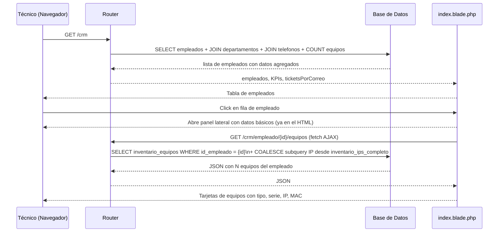

# Módulo CRM — Directorio de Empleados

**Ruta base:** `/crm`  
**Estado:** ✅ Funcional — CRUD completo, panel lateral con equipos e IPs reales

---

## ¿Qué hace este módulo?

Es el directorio de personal del instituto. Muestra todos los empleados con su departamento, extensión telefónica y cantidad de equipos asignados. Desde aquí un técnico puede consultar rápidamente quién tiene qué equipo, a qué área pertenece y cómo contactarlo.

El panel lateral (derecho) permite ver el detalle completo de un empleado: sus activos, historial de tickets y datos de contacto.

---

## Archivos del módulo

```
Modules/CRM/
├── app/
│   └── Http/Controllers/
│       └── CRMController.php    ← store, update, destroy, reactivar
├── resources/views/
│   └── index.blade.php          ← tabla de empleados + panel lateral + modales
└── routes/
    └── web.php                  ← rutas (closures para GET, CRMController para escritura)
```

---

## Tablas de base de datos

| Tabla | Propósito |
|---|---|
| `empleados` | Directorio de personal activo e inactivo |
| `departamentos` | Catálogo de áreas/direcciones del instituto |
| `telefonos` | Extensiones telefónicas por empleado |
| `inventario_equipos` | Equipos asignados (JOIN para contar cuántos tiene cada quien) |

### Esquema de `empleados`

| Columna | Tipo | Descripción |
|---|---|---|
| `id_empleado` | entero auto | Identificador único |
| `nombre` | texto | Primer nombre |
| `apellido_paterno` | texto | Apellido paterno |
| `apellido_materno` | texto | Apellido materno |
| `puesto` | texto | Puesto o cargo |
| `correo` | texto | Correo institucional (también usado en tickets) |
| `id_departamento` | entero FK | Referencia a `departamentos` |
| `activo` | booleano | `true`=activo, `false`=baja |
| `fecha_alta` | fecha | Cuándo se dio de alta |
| `fecha_baja` | fecha | Cuándo se dio de baja (null si activo) |

---

## Rutas

```
GET    /crm                          → tabla de empleados + KPIs (closure en routes/web.php)
POST   /crm/empleados                → alta de nuevo empleado (CRMController@store)
PATCH  /crm/empleados/{id}           → editar empleado (CRMController@update)
DELETE /crm/empleados/{id}           → dar de baja (CRMController@destroy)
PATCH  /crm/empleados/{id}/reactivar → reactivar empleado (CRMController@reactivar)
GET    /crm/empleado/{id}/equipos    → JSON con equipos del empleado (AJAX para panel lateral)
```

---

## Diagrama de Secuencia — Consultar directorio y panel lateral



---

## La consulta principal explicada

La query principal está en `routes/web.php` (closures — deuda técnica para mover a controlador):

```php
$empleados = DB::table('empleados')
    ->leftJoin('departamentos', 'empleados.id_departamento', '=', 'departamentos.id_departamento')
    ->leftJoin('telefonos', 'empleados.id_empleado', '=', 'telefonos.id_empleado')
    ->leftJoin('inventario_equipos', 'empleados.id_empleado', '=', 'inventario_equipos.id_empleado')
    ->select(
        'empleados.*',
        'departamentos.nombre as departamento_nombre',
        'telefonos.extension',
        DB::raw('COUNT(inventario_equipos.id) as total_equipos')
    )
    ->groupBy('empleados.id_empleado', 'departamentos.nombre', 'telefonos.extension')
    ->orderBy('empleados.nombre')
    ->get();
```

El JOIN con `inventario_equipos` funciona porque la migración `2026_07_09_000002` ya pobló `inventario_equipos.id_empleado` para 110 de 180 equipos. El `total_equipos` de esos empleados refleja el conteo real.

---

## Panel lateral — cómo funciona

El panel lateral tiene dos capas:

1. **Datos básicos** (nombre, correo, departamento, extensión) — ya están en el HTML inicial, se inyectan con `data-*` attributes.

2. **Sección de equipos** — se carga vía AJAX al abrir el panel:

```javascript
async function openUserPanel(id) {
    // Abre el panel con spinner
    const equipos = await fetch(`/crm/empleado/${id}/equipos`).then(r => r.json());
    renderEquiposPanel(equipos);
}
```

El endpoint `/crm/empleado/{id}/equipos` devuelve un JSON con todos los equipos del empleado. Para cada equipo incluye:
- `tipo`, `cpu_marca`, `cpu_modelo`, `cpu_serie`
- `ipv4` — resuelto via `COALESCE(inventario_equipos.ipv4, subquery inventario_ips_completo)`
- `mac`
- `match` — `'fk'` (vinculado por ID) o `'nombre'` (fallback por nombre_usuario)

La función `renderEquiposPanel()` genera tarjetas visuales. Los equipos con `match='fk'` tienen borde verde + badge "VINCULADO"; los con `match='nombre'` tienen borde gris + badge "POR NOMBRE".

---

## CRUD implementado

| Acción | Cómo | Resultado |
|---|---|---|
| Alta | Modal "Nuevo Empleado" con campos colapsables para teléfono y equipos | POST /crm/empleados |
| Editar | Modal "Editar" que prellenan los datos actuales | PATCH /crm/empleados/{id} |
| Baja | Botón en el panel lateral | DELETE /crm/empleados/{id} → `activo = false` |
| Reactivar | Botón visible cuando el empleado está inactivo | PATCH /crm/empleados/{id}/reactivar → `activo = true` |

---

## Filtros de la tabla

El campo de búsqueda y los selectores de departamento/estado son client-side: leen los atributos `data-nombre`, `data-correo`, `data-departamento`, `data-activo` de cada fila y ocultan/muestran con `classList.toggle('hidden')`.

---

## Pendiente / Lo que falta

- [ ] Mover queries de `routes/web.php` a `CRMController`
- [ ] Tab "Historial" del panel lateral (actualmente placeholder)
- [ ] Tab "Tickets" del panel lateral conectado con datos reales
- [ ] Importación masiva de empleados desde Excel
