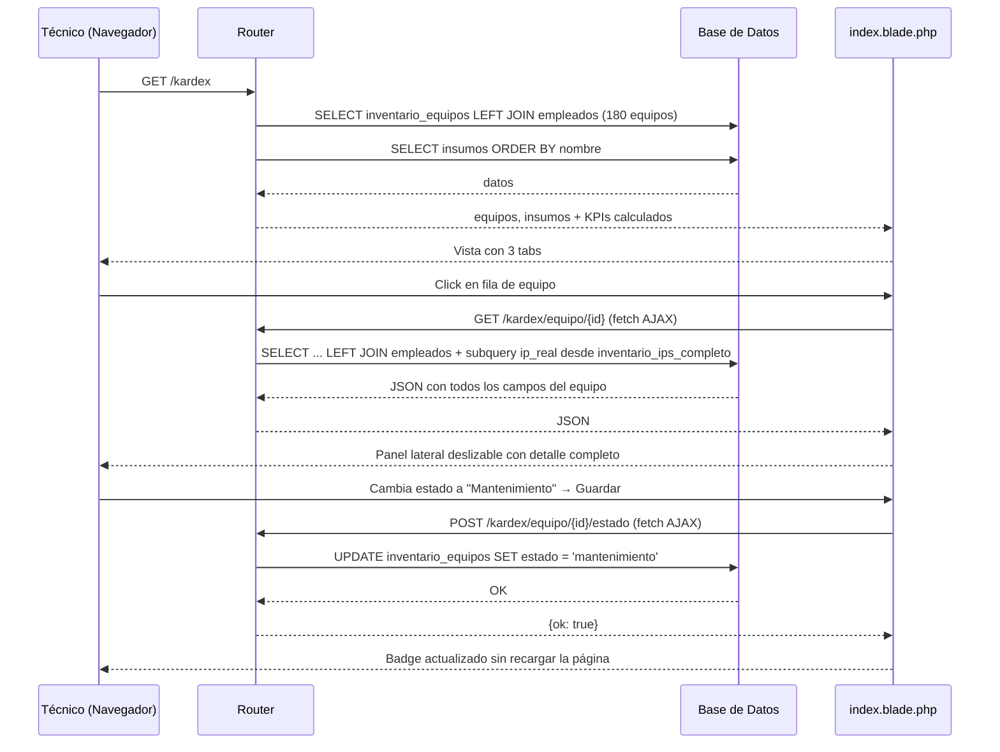

# Módulo Kardex — Inventario de Equipos e Insumos

**Ruta base:** `/kardex`  
**Estado:** ✅ Funcional — lecturas y panel de detalle operativos; alta de equipo y movimientos de insumos pendientes

---

## ¿Qué hace este módulo?

Maneja el inventario físico del departamento de TI. Tiene tres secciones (tabs):

1. **Equipos** — inventario de laptops, PCs y equipos especializados con responsable, estado y filtros
2. **Insumos** — stock de consumibles (tóner, cartuchos, cables, etc.) con alertas de stock crítico
3. **Resguardos** — todos los equipos con indicador de PDF de resguardo adjunto

---

## Archivos del módulo

```
Modules/Kardex/
├── app/
│   └── Http/Controllers/
│       └── KardexController.php     ← extracción y guardado de resguardos PDF
├── database/migrations/
│   ├── 2026_07_09_000001_...        ← agrega columna estado a inventario_equipos
│   └── 2026_07_09_000002_...        ← vincula FKs e IPs (corre después de app:boot)
├── resources/views/
│   ├── index.blade.php              ← tres tabs + panel lateral AJAX
│   ├── resguardo-subir.blade.php    ← formulario de subida de PDF
│   └── resguardo-preview.blade.php  ← previsualización antes de guardar
└── routes/
    └── web.php                      ← todas las rutas (closures + KardexController)
```

---

## Tablas de base de datos

| Tabla | Propósito |
|---|---|
| `inventario_equipos` | Un registro por equipo físico |
| `insumos` | Stock de consumibles |
| `empleados` | Para relacionar equipo ↔ responsable |
| `inventario_ips_completo` | Para obtener la IP real via `serie = cpu_serie` |

### Esquema de `inventario_equipos` (columnas clave)

| Columna | Tipo | Descripción |
|---|---|---|
| `id` | entero auto | Identificador único |
| `tipo` | texto | `'Laptop'`, `'PC Avanzada'`, `'PC Especializada'` |
| `consecutivo` | entero | Número de secuencia dentro del tipo |
| `num_inventario` | texto | Código institucional ej: `LAP-001` |
| `nombre_usuario` | texto | Nombre libre del responsable (campo de texto del Excel original) |
| `area` | string | Área donde está físicamente el equipo |
| `cpu_marca` / `cpu_modelo` | texto | Fabricante y referencia del equipo |
| `cpu_serie` | texto | **Número de serie del fabricante** — clave para vincular con `inventario_ips_completo` |
| `ipv4` | texto | IP asignada — se pobló desde `inventario_ips_completo.ip` via `serie = cpu_serie` |
| `mac` | texto | Dirección MAC |
| `id_empleado` | entero FK | Referencia a `empleados` (null = en almacén). Poblado por migración de datos. |
| `estado` | texto nullable | `null` = derivado (Asignado/Almacén), `'mantenimiento'`, `'baja'` |
| `pdf_resguardo` | texto | Ruta relativa dentro de `storage/app/` al PDF adjunto |

### Lógica de estado visible

El `estado` que se muestra en la tabla es derivado en el servidor:

```php
$estadoDisplay = match(true) {
    $eq->estado === 'mantenimiento' => 'Mantenimiento',   // marcado explícitamente
    $eq->estado === 'baja'          => 'Baja',            // marcado explícitamente
    !is_null($eq->id_empleado)      => 'Asignado',        // tiene FK a empleado
    default                         => 'Almacén',          // sin asignación
};
```

### Esquema de `insumos`

| Columna | Tipo | Descripción |
|---|---|---|
| `id` | entero auto | Identificador único |
| `numero_parte` | texto | Código del fabricante |
| `nombre_insumo` | texto | Descripción del consumible |
| `stock_actual` | entero | Cantidad disponible en almacén |
| `stock_minimo` | entero | Umbral de alerta crítica |

---

## Rutas

```
GET  /kardex                       → carga la vista principal (closure en routes/web.php)
GET  /kardex/equipo/{id}           → JSON con detalle completo del equipo (panel lateral)
POST /kardex/equipo/{id}/estado    → cambia la columna estado del equipo
GET  /kardex/equipo/{id}/pdf       → descarga el PDF de resguardo desde storage local
GET  /kardex/resguardo/subir       → formulario para subir PDF
POST /kardex/resguardo/extraer     → extrae datos del PDF y guarda temporal en session
GET  /kardex/resguardo/preview     → previsualización antes de confirmar
POST /kardex/resguardo/guardar     → guarda el equipo en BD y mueve el PDF a su lugar
GET  /kardex/resguardo/ip          → sugiere IP libre para un área (AJAX)
```

---

## Diagrama de Secuencia — Cargar el Kardex



---

## Panel lateral AJAX

El panel lateral (`id="equipo-panel"`) se abre al hacer clic en cualquier fila de la tabla de equipos. Usa `fetch()` para pedir el JSON del equipo:

```javascript
async function abrirPanelEquipo(id) {
    const eq = await fetch(`/kardex/equipo/${id}`).then(r => r.json());
    // eq.ipv4_real: IP desde inventario_ips_completo via serie (COALESCE)
    // eq.mac_real:  MAC desde inventario_ips_completo via serie
    // eq.empleado_nombre: nombre completo del empleado (JOIN a empleados)
    // eq.estado: 'mantenimiento' | 'baja' | null
}
```

El JSON incluye `ipv4_real` y `mac_real` que son subqueries COALESCE:
- Primero usa `inventario_equipos.ipv4` (si está poblado)
- Si no, busca en `inventario_ips_completo` donde `LOWER(TRIM(serie)) = LOWER(TRIM(cpu_serie))`

---

## Filtros de la tabla de equipos

Los filtros son client-side. Cada `<tr>` tiene atributos `data-*`:

```html
<tr data-tipo="Laptop"
    data-estado="Asignado"
    data-texto="dell latitude 3420 jessica sigales">
```

La función `filtrarEquipos()` en JavaScript oculta/muestra filas comparando esos atributos con los valores de los selects y el input de búsqueda. No hace nuevas peticiones al servidor.

---

## Flujo de registro vía PDF de resguardo

```mermaid
flowchart TD
    A([Técnico sube PDF del resguardo]) --> B{¿PDF tiene texto nativo?\nmb_strlen > 80}

    B -- Sí --> C[smalot/pdfparser extrae texto\nregex mapea campos]
    B -- No / escaneado --> D[Formulario vacío con banner amarillo\nTécnico captura manualmente]

    C --> E[Previsualización con datos extraídos]
    D --> E

    E --> F{¿Técnico confirma?}
    F -- No --> G[Técnico corrige campos en el form]
    G --> F
    F -- Sí --> H{¿El usuario ya existe en empleados?}

    H -- Sí --> I[Vincular al empleado existente]
    H -- No encontrado --> J[Guardar sin id_empleado\nnombre_usuario como texto]

    I --> K[Guardar equipo en inventario_equipos]
    J --> K
    K --> L[Mover PDF a storage/app/resguardos/{id}.pdf]
    L --> M[Actualizar pdf_resguardo en BD]
    M --> N([Registro completo])
```

> **Importante:** el sistema NO usa Gemini API ni ningún LLM para leer PDFs escaneados. Los PDFs escaneados se aceptan, se muestra el formulario vacío y el técnico captura los datos manualmente.

---

### Detección de PDF nativo vs escaneado

```php
$texto   = $pdf->getText();
$esNativo = mb_strlen(trim($texto)) > 80;  // true = tiene texto, false = imagen

$datos = $esNativo
    ? $this->extraerCampos($texto)   // regex sobre el texto
    : array_fill_keys([...], null);  // formulario vacío
```

---

### Campos capturados por tipo de equipo

| Campo | Laptop | PC Avanzada | PC Especializada |
|---|:---:|:---:|:---:|
| `cpu_marca` / `cpu_modelo` / `cpu_serie` | ✅ | ✅ | ✅ |
| `cargador_serie` | ✅ | ❌ | ❌ |
| `docking_marca` / `docking_serie` | opcional | ❌ | ❌ |
| `monitor_marca` / `monitor_modelo` / `monitor_serie` | ❌ | ✅ | ✅ |
| `teclado_serie` | ❌ | ✅ | ✅ |
| `mouse_serie` | ❌ | ✅ | ✅ |
| `nobreak_marca` / `nobreak_serie` | ❌ | ✅ | ✅ |
| `ipv4` / `mac` | ✅ | ✅ | ✅ |
| `observaciones` | ✅ | ✅ | ✅ |

---

## Stock crítico de insumos

Un insumo es crítico cuando `stock_actual <= stock_minimo`:

```php
$criticos = $insumos->filter(fn($i) => $i->stock_actual <= $i->stock_minimo)->count();
```

---

## Pendiente / Lo que falta

- [ ] Mover queries de `routes/web.php` a `KardexController`
- [ ] Formulario de alta de nuevo equipo
- [ ] Registrar entrada/salida de insumos (tabla `suministros` ya existe)
- [ ] Generar PDF de resguardo desde el sistema (dompdf instalado, no implementado)
- [ ] Asignar equipo a empleado desde la UI (actualizar `id_empleado`)
