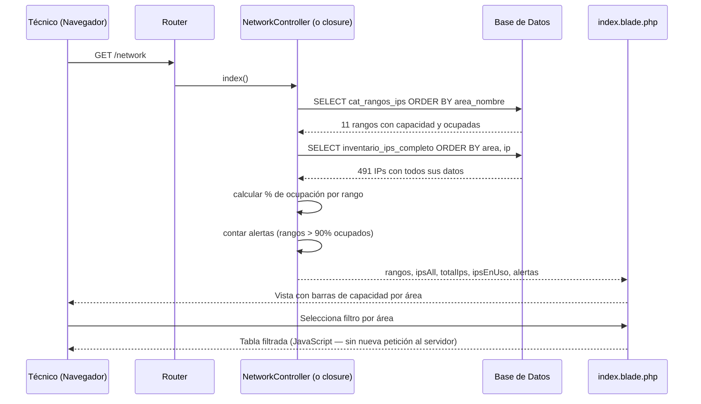

# Módulo Network — Direccionamiento IP

**Ruta base:** `/network`  
**Estado:** ✅ Vista funcional — edición pendiente

---

## ¿Qué hace este módulo?

Muestra el inventario de direcciones IP de toda la red institucional. Tiene dos tabs:

1. **Rangos** — cada área del instituto tiene un rango de IPs asignado. Muestra cuántas IPs están ocupadas vs disponibles con una barra de capacidad, y alerta cuando un segmento está al 90% o más.
2. **Inventario** — lista completa de todas las IPs registradas, quién las usa, qué equipo, qué MAC y qué permisos de internet tiene.

---

## Archivos del módulo

```
Modules/Network/
├── app/
│   └── Http/Controllers/
│       └── NetworkController.php    ← actualmente vacío (deuda técnica)
├── resources/views/
│   └── index.blade.php              ← dos tabs: Rangos e Inventario
└── routes/
    └── web.php                      ← ⚠️ queries en el archivo de rutas (deuda técnica)
```

---

## Tablas de base de datos

| Tabla | Propósito |
|---|---|
| `inventario_ips_completo` | Un registro por IP registrada (491 IPs) |
| `cat_rangos_ips` | Un registro por segmento de red por área (11 rangos) |

### Esquema de `inventario_ips_completo`

| Columna | Tipo | Descripción |
|---|---|---|
| `id` | entero auto | Identificador único |
| `ip` | texto | Dirección IP (IPv4) |
| `usuario` | texto | Nombre de usuario o equipo asignado |
| `tipo_equipo` | texto | `LAP`, `PC`, `IMP`, etc. |
| `mac` | texto | Dirección MAC física del dispositivo |
| `tipo_conexion` | texto | `ALÁMBRICO` o `INALÁMBRICO` |
| `estatus` | texto | `Ocupada` o `Disponible` |
| `departamento_pestana` | texto | Área a la que pertenece |
| `youtube`, `facebook`, ... | texto | Permisos de internet por categoría (`Sí`/`NO`) |
| `id_empleado` | entero FK | Referencia a `empleados` (actualmente `null` en todos los registros) |

### Esquema de `cat_rangos_ips`

| Columna | Tipo | Descripción |
|---|---|---|
| `id` | entero auto | |
| `area_nombre` | texto | Nombre del área institucional |
| `rango_inicio` | texto | Primera IP del segmento |
| `rango_fin` | texto | Última IP del segmento |
| `capacidad_total` | entero | Total de IPs en el segmento |
| `ocupadas` | entero | Cuántas están en uso |

---

## Rutas

```
GET /network   → NetworkController@index   (solo auth)
```

---

## Diagrama de Secuencia — Cargar el mapa de red



---

## Cómo se calcula la alerta de capacidad

```php
$alertas = $rangos->filter(function ($rango) {
    // Un rango alerta si está lleno al 90% o más
    return $rango->capacidad_total > 0
        && ($rango->ocupadas / $rango->capacidad_total) > 0.90;
})->count();
```

En la vista, el color de la barra cambia según el porcentaje:

```blade
@php $pct = $rango->capacidad_total > 0
    ? round($rango->ocupadas / $rango->capacidad_total * 100)
    : 0;
@endphp

<div class="h-2 rounded-full
    {{ $pct >= 90 ? 'bg-red-500' : ($pct >= 70 ? 'bg-yellow-400' : 'bg-green-500') }}"
    style="width: {{ $pct }}%">
</div>
```

| Color | Condición | Significado |
|---|---|---|
| 🟢 Verde | < 70% | Normal |
| 🟡 Amarillo | 70% – 89% | Precaución |
| 🔴 Rojo | ≥ 90% | Crítico — planear expansión |

---

## Los permisos de internet

Cada IP tiene columnas booleanas para categorías de sitios. Actualmente se almacenan como texto `"Sí"` / `"NO"`:

```
youtube, vimeo, spotify, otros_streaming,
facebook, tiktok, instagram, whatsapp_web, otra_red_social,
sitios_gub, noticias, otro_permiso
```

Esto permite a TI documentar qué equipo tiene acceso a qué. No es un sistema de firewall — es un registro de la configuración que está en los switches/proxies.

---

## Nota sobre `id_empleado`

Actualmente **todos los registros tienen `id_empleado = null`**. Eso significa que la IP sabe quién la usa (campo `usuario`) pero no está formalmente vinculada a un empleado de la tabla `empleados`. 

El campo `usuario` contiene nombres informales como `xgranados` o `Karla Perez` que no mapean directamente a los correos en `empleados`.

**Tarea pendiente de alta prioridad:** poblar `id_empleado` en `inventario_ips_completo` cruzando manualmente los datos de `usuario` con `empleados`. Eso permitirá mostrar el perfil completo del empleado al hacer click en una IP.

---

## Pendiente / Lo que falta

- [ ] Mover queries de `routes/web.php` a `NetworkController@index`
- [ ] Poblar `id_empleado` en `inventario_ips_completo` (tarea de datos, no de código)
- [ ] Click en una IP → panel lateral con datos del equipo y empleado
- [ ] Formulario para cambiar `estatus` de una IP (marcar como disponible/ocupada)
- [ ] Formulario para actualizar permisos de internet de una IP
- [ ] Exportar inventario a Excel
