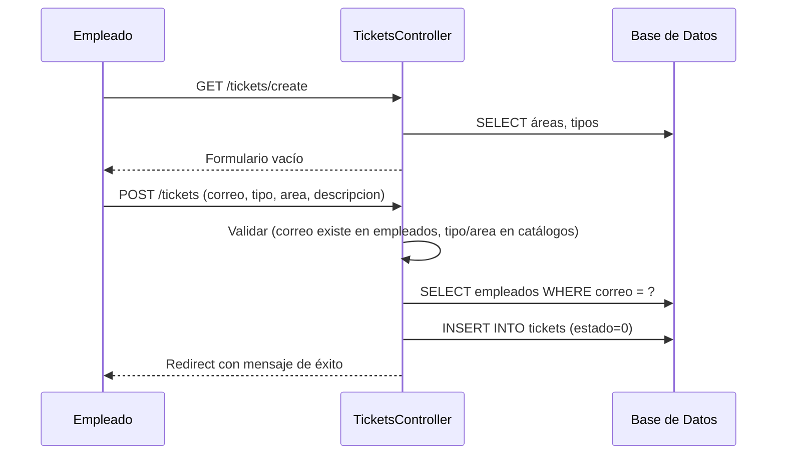
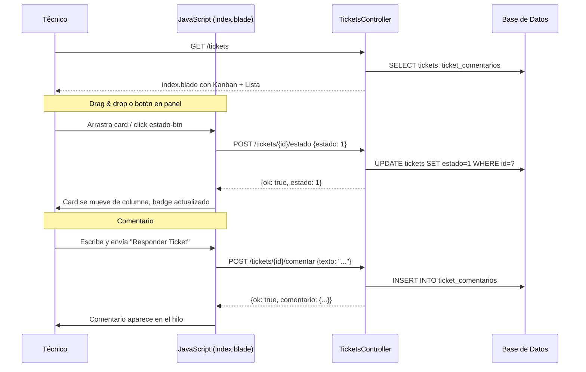
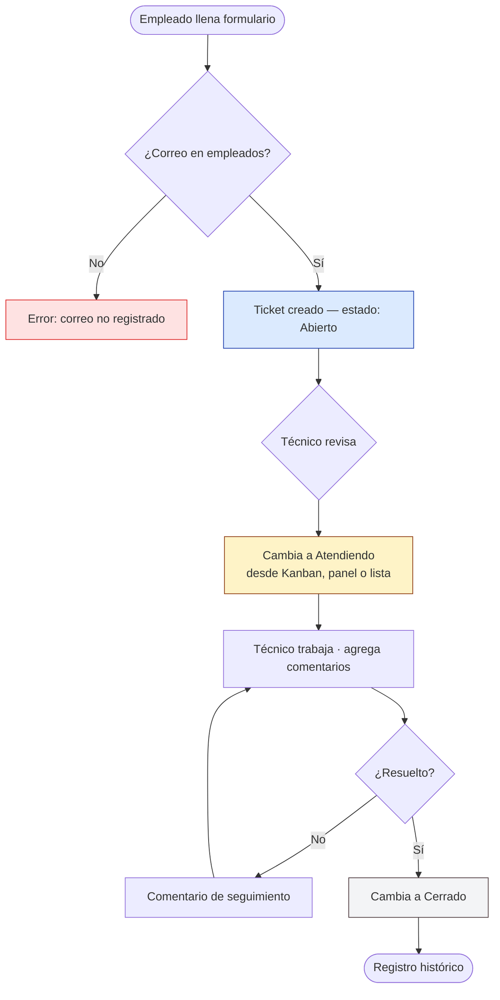

# Módulo Tickets

**Ruta base:** `/tickets`  
**Estado:** ✅ Funcional — formulario público + vista de gestión completa (Kanban + lista + panel de detalle)

---

## ¿Qué hace este módulo?

Gestiona el ciclo de vida de las solicitudes de soporte técnico. Tiene dos caras:

- **Pública** (`/tickets/create`): Cualquier empleado puede abrir un ticket sin login. Solo necesita su correo institucional.
- **Interna** (`/tickets`): Solo personal de TI autenticado. Incluye vista Kanban drag & drop, vista lista filtrable, y panel lateral de detalle con comentarios y cambio de estado.

---

## Archivos del módulo

```
Modules/Tickets/
├── app/
│   ├── Http/Controllers/
│   │   └── TicketsController.php   ← toda la lógica del módulo
│   └── Models/
│       └── Ticket.php              ← modelo Eloquent (solo usado en store)
├── database/
│   ├── migrations/
│   │   ├── 2025_01_01_000010_create_tickets_table.php
│   │   └── 2025_01_01_000012_create_ticket_comentarios_table.php
│   └── seeders/
│       └── TicketsCatalogoSeeder.php  ← carga áreas y tipos
├── resources/views/
│   ├── index.blade.php             ← vista de gestión (Kanban + lista + panel)
│   ├── create.blade.php            ← formulario público (sin login)
│   └── create-internal.blade.php  ← formulario con sidebar (usuario logueado)
└── routes/
    └── web.php
```

---

## Tablas de base de datos

| Tabla | Propósito |
|---|---|
| `tickets` | Un registro por solicitud de soporte |
| `ticket_comentarios` | Hilo de comentarios por ticket |
| `areas` | Catálogo de áreas institucionales |
| `tipos` | Catálogo de tipos de incidente |

### Esquema de `tickets`

| Columna | Tipo | Descripción |
|---|---|---|
| `id` | entero auto | Identificador único |
| `nombre` | texto | Nombre del solicitante (resuelto de `empleados`) |
| `correo` | texto | Correo del solicitante |
| `ip` | texto | IP capturada al enviar el formulario |
| `mac` | texto | Dirección MAC (si el empleado está en la misma red) |
| `area` | texto | Nombre del área (FK lógica a catálogo `areas`) |
| `tipo` | texto | Tipo de incidente (FK lógica a catálogo `tipos`) |
| `descripcion` | texto | Descripción del problema |
| `estado` | entero | `0`=Abierto · `1`=Atendiendo · `2`=Cerrado |
| `comentarios` | texto | Campo heredado — hoy se usan `ticket_comentarios` |
| `atendido_at` | fecha | Pendiente de uso (columna existe, lógica comentada) |
| `atendido_by` | texto | Email del técnico asignado |
| `cerrado_at` | fecha | Pendiente de uso (columna existe, lógica comentada) |
| `cerrado_by` | texto | Pendiente de uso |

### Esquema de `ticket_comentarios`

| Columna | Tipo | Descripción |
|---|---|---|
| `id` | entero auto | — |
| `ticket_id` | entero | FK a `tickets.id` |
| `autor_nombre` | texto | Nombre del técnico que comentó |
| `autor_email` | texto | Email del técnico |
| `texto` | texto | Cuerpo del comentario |
| `created_at` / `updated_at` | timestamps | — |

---

## Rutas

| Método | URI | Auth | Controlador | Descripción |
|---|---|---|---|---|
| `GET` | `/tickets/create` | No | `create()` | Formulario público |
| `POST` | `/tickets` | No | `store()` | Guardar nuevo ticket |
| `GET` | `/tickets` | Sí | `index()` | Vista de gestión |
| `POST` | `/tickets/{id}/estado` | Sí | `cambiarEstado()` | Cambiar estado del ticket |
| `PATCH` | `/tickets/{id}/estado` | Sí | `cambiarEstado()` | Alias (misma acción) |
| `POST` | `/tickets/{id}/comentar` | Sí | `comentar()` | Agregar comentario |
| `PATCH` | `/tickets/{id}/asignar` | Sí | `asignar()` | Asignar técnico |
| `GET` | `/tickets/api/conteo` | Sí | `conteo()` | JSON con totales — llamado bajo demanda (sin polling) |

---

## Vista de gestión (`index.blade.php`)

La vista principal tiene dos modos, controlados con botones toggle:

### Vista Kanban

Tres columnas: **Abierto** / **Atendiendo** / **Cerrado**. Cada card muestra nombre, tipo, descripción (truncada) y tiempo transcurrido.

- **Drag & drop:** usa [SortableJS](https://sortablejs.com/), importado en `resources/js/app.js` y expuesto como `window.Sortable`. El drag se inicia solo desde la barra superior de cada card (`.drag-handle`) — el cuerpo del card abre el panel.
- Al soltar el card en otra columna, se hace `POST /tickets/{id}/estado` automáticamente.
- Los Cerrados se ocultan automáticamente si superan 3.

### Vista Lista

Tabla con columnas: Folio · Solicitante · Área/Tipo · Descripción · Estado · Fecha · Acciones.

- Filtros en tiempo real por estado, área y texto libre.
- El badge de estado se actualiza visualmente en la fila sin recargar cuando se cambia desde el panel.

### Panel lateral de detalle

Se abre al hacer click sobre cualquier fila de la tabla o el cuerpo de un card Kanban (también con el botón `reply` de la fila). Se cierra con `Escape` o el botón ×.

Contenido del panel:
- Folio + badge de estado
- Tipo + tiempo transcurrido (icono cambia según urgencia)
- Tarjeta del solicitante: nombre, correo, área
- Descripción completa
- IP y MAC (visibles para el técnico)
- Hilo de comentarios (de `ticket_comentarios`)
- Textarea + botón **Responder Ticket** para agregar comentarios
- Selector para asignar técnico
- Botones de cambio de estado: **Abierto / Atendiendo / Cerrado**

---

## Flujo completo — Diagramas de secuencia

### Empleado abre un ticket



### Técnico gestiona tickets



---

## Ciclo de vida de un ticket



---

## JavaScript — funciones principales

Todas las funciones viven en el `<script>` al final de `index.blade.php`. Todos los `addEventListener` están dentro de `DOMContentLoaded`.

| Función | Qué hace |
|---|---|
| `openPanel(el)` | Abre el panel lateral. Recibe el elemento card o `<tr>`, lee `data-ticket` (JSON), puebla todos los IDs del panel. Protegido con `try/catch` para que un error nunca congele la UI. |
| `closePanel()` | Cierra el panel, limpia `currentTicketId`. |
| `inicializarSortable()` | Crea instancias SortableJS en cada `.kanban-col-body`. Usa `handle: '.drag-handle'` para separar zona de arrastre del click. Espera a que `window.Sortable` esté disponible antes de inicializar. |
| `fetchJson(url, method, body)` | Helper fetch centralizado. Siempre envía `X-CSRF-TOKEN` y `X-Requested-With`. Logea en consola si la respuesta no es 2xx. |
| `actualizarTiempos()` | Recalcula los labels de tiempo relativo ("Ahora", "5 min", "2 h") en todos los cards y filas. Se ejecuta cada 60s. |
| `actualizarContadoresColumnas()` | Cuenta los cards en cada columna y actualiza los badges de número. |
| `checkNuevosTickets()` | Llama a `/tickets/api/conteo`. Si hay más abiertos que al cargar, muestra banner. Se dispara al volver a la pestaña (`window focus`) y tras cada cambio de estado — sin polling periódico. |
| `aplicarAutoHideCerrados()` | Oculta automáticamente los cerrados si hay más de 3 en la columna Kanban. |

### Variables globales del script

```js
const CSRF        = '{{ csrf_token() }}';          // Token CSRF de Blade
const comentarios = {!! json_encode(...) !!};       // Comentarios precargados por ticket
let currentTicketId = null;                         // ID del ticket abierto en el panel
let _isDragging     = false;                        // Flag para no abrir panel al soltar drag
```

---

## Notas para becarios — cosas no obvias

**`data-ticket` en los elementos:**  
Cada card de Kanban y cada `<tr>` de la lista tienen `data-ticket="{{ json_encode($td) }}"`. El `{{ }}` de Blade hace el HTML-escape correcto para el atributo. NO usar `{{ e(json_encode($td)) }}` — doble-escapa y rompe `JSON.parse`.

**Por qué hay rutas `POST` y `PATCH` para `/estado`:**  
Las dos hacen exactamente lo mismo. El `POST` existe porque en algunos entornos o proxies el método `PATCH` puede ser bloqueado. El JS siempre usa `POST`.

**`atendido_at` y `cerrado_at` comentados:**  
El controlador tiene código comentado para registrar quién y cuándo atendió/cerró. Está listo para activarse cuando se confirme que las columnas existen en producción. Buscar en `TicketsController.php` el comentario `Vestigio`.

**SortableJS:**  
Se importa en `resources/js/app.js` (`import Sortable from 'sortablejs'`) y se expone como `window.Sortable`. El Vite bundle se regenera con `npm run build`. El script de la vista lo espera con un retry de 80ms si todavía no está disponible.

---

## Pendiente / Lo que falta

- [ ] Activar `atendido_at` / `cerrado_at` / `cerrado_by` una vez confirmadas las columnas en producción (código ya existe, solo descomentar en `cambiarEstado`)
- [ ] Filtros por estado/área/tipo en la vista lista (UI pendiente)
- [ ] Notificación por correo al empleado cuando su ticket se cierra
- [ ] Control de roles: que solo admins puedan cerrar tickets (columna `role` existe pero no se usa)
- [ ] UI para gestionar catálogos de Áreas y Tipos (actualmente solo via seeder o BD directo)
