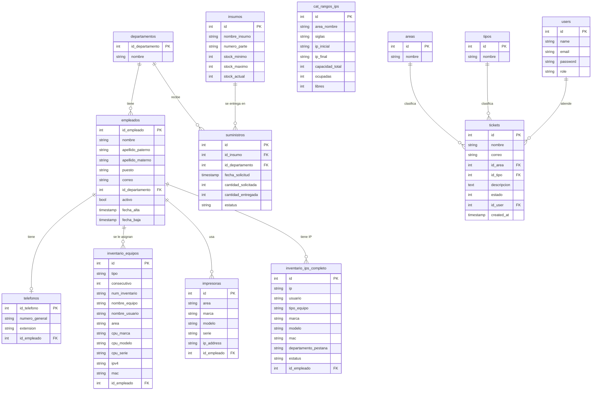
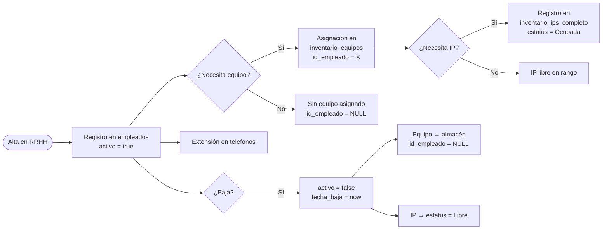
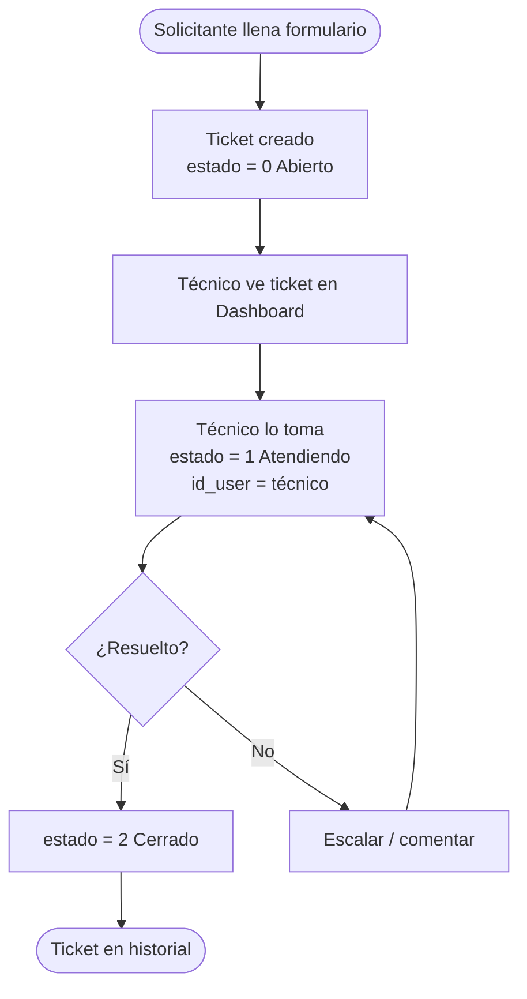
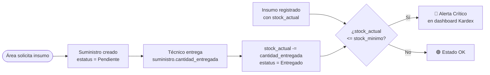

# Base de Datos — Modelo de Datos, Flujo y Ciclo de Vida

---

## Diagrama del modelo de datos (Entidad-Relación)



> **Cómo renderizar este diagrama:** cualquier editor que soporte Mermaid (GitHub, GitLab, Obsidian, VS Code con extensión Mermaid Preview) renderiza el bloque anterior como un diagrama visual. En GitHub se ve automáticamente al abrir el archivo.

---

## Tablas en detalle

### `departamentos`
Las 18 áreas/direcciones del instituto. Son el catálogo base del que dependen empleados, equipos e insumos.

| Campo | Tipo | Descripción |
|---|---|---|
| `id_departamento` | PK | Auto-incremental |
| `nombre` | string(120) | Nombre completo del área. Único. |

**Datos actuales:** 18 departamentos cargados del `directorio_imjuve.xlsx`.

---

### `empleados`
El directorio institucional. Cada persona que trabaja en el instituto.

| Campo | Tipo | Descripción |
|---|---|---|
| `id_empleado` | PK | Auto-incremental |
| `nombre` | string(80) | Nombre(s) |
| `apellido_paterno` | string(80) | Apellido paterno |
| `apellido_materno` | string(80) | Apellido materno |
| `puesto` | string(120) | Cargo institucional |
| `correo` | string(120) | Correo institucional (generado como `nombre.apellido@imjuve.gob.mx`) |
| `id_departamento` | FK | Área a la que pertenece. NULL si no tiene área asignada |
| `activo` | bool | `true` = en activo, `false` = baja |
| `fecha_alta` | timestamp | Cuándo fue dado de alta en el sistema |
| `fecha_baja` | timestamp | Cuándo fue dado de baja (null si activo) |

**Datos actuales:** 19 empleados del `directorio_imjuve.xlsx`.

> **Nota de diseño:** esta tabla fusiona lo que eran dos tablas separadas en los sistemas originales: `usuarios` del sistema de inventario y `empleados` del sistema de tickets. Eran el mismo dato con diferente nombre.

---

### `telefonos`
Una extensión telefónica por empleado.

| Campo | Tipo | Descripción |
|---|---|---|
| `id_telefono` | PK | Auto-incremental |
| `numero_general` | string | Número central de la institución |
| `extension` | string | Extensión interna (ej. `"3215"`) |
| `id_empleado` | FK | Empleado al que pertenece. NULL si es línea compartida |

---

### `inventario_equipos`
Todos los equipos de cómputo asignados o en almacén.

| Campo | Tipo | Descripción |
|---|---|---|
| `tipo` | string | `'Laptop'`, `'PC Avanzada'` o `'PC Especializada'` |
| `num_inventario` | string | Número de inventario institucional (ej. `"SEJUV-2024-0045"`) |
| `nombre_equipo` | string | Hostname del equipo |
| `nombre_usuario` | string | Nombre del usuario asignado (texto libre del Excel original) |
| `area` | string | Área donde está físicamente |
| `cpu_marca/modelo/serie` | string | Especificaciones del procesador/equipo |
| `cargador/docking_*` | string | Series de accesorios |
| `ipv4` | string | IP asignada en la tabla de inventario |
| `mac` | string | Dirección MAC |
| `responsiva` | string | Número de resguardo/responsiva firmada |
| `id_empleado` | FK | Empleado al que está asignado. NULL = en almacén |

**Datos actuales:** 183 equipos — 93 Laptops, 23 PCs Especializadas, 67 PCs Avanzadas.

---

### `impresoras`

| Campo | Tipo | Descripción |
|---|---|---|
| `area` | string | Área donde está la impresora |
| `marca` / `modelo` | string | Identificación del equipo |
| `firmware` | string | Versión de firmware instalada |
| `serie` | string | Número de serie físico |
| `ip_address` | string(45) | IP asignada (cubre IPv4 e IPv6) |
| `id_empleado` | FK | Responsable de la impresora |

**Datos actuales:** 10 impresoras del `SOLICITUDES TONER Y STOCK.xlsx`.

---

### `insumos` y `suministros`

`insumos`: catálogo de consumibles (toners, cartuchos, etc.)

| Campo | Tipo | Descripción |
|---|---|---|
| `nombre_insumo` | string | Descripción del insumo |
| `numero_parte` | string | Part number del fabricante |
| `stock_minimo` | int | Cantidad mínima aceptable |
| `stock_maximo` | int | Capacidad máxima de almacén |
| `stock_actual` | int | Piezas disponibles ahora mismo |

`suministros`: registro de cada entrega a un área.

| Campo | Tipo | Descripción |
|---|---|---|
| `id_insumo` | FK | Qué insumo se entregó |
| `id_departamento` | FK | A qué área se entregó |
| `fecha_solicitud` | timestamp | Cuándo se solicitó |
| `cantidad_solicitada` | int | Piezas pedidas |
| `cantidad_entregada` | int | Piezas realmente entregadas |
| `estatus` | string | `'Pendiente'`, `'Entregado'`, `'Cancelado'` |

**Datos actuales:** 8 insumos del `SOLICITUDES TONER Y STOCK.xlsx`.

---

### `cat_rangos_ips` e `inventario_ips_completo`

`cat_rangos_ips`: los 11 rangos de red, uno por área institucional.

| Campo | Tipo | Descripción |
|---|---|---|
| `area_nombre` | string | Nombre completo del área |
| `siglas` | string | Sigla del área (DG, DBEJ, SS, etc.) |
| `ip_inicial` / `ip_final` | string | Extremos del rango |
| `capacidad_total` | int | IPs disponibles en el rango |
| `ocupadas` / `libres` | int | Estado del rango |

`inventario_ips_completo`: registro individual de cada IP.

| Campo | Tipo | Descripción |
|---|---|---|
| `ip` | string(45) UNIQUE | Dirección IP (índice único) |
| `usuario` | string | Nombre del usuario que la usa |
| `tipo_equipo` | string | Laptop, PC, impresora, etc. |
| `institucional_o_personal` | string | Si el equipo es del instituto o personal |
| `mac` | string | Dirección MAC del dispositivo |
| `tipo_conexion` | string | Cableado / WiFi |
| `config_red` | string | DHCP / Estática |
| `departamento_pestana` | string | Siglas del área (DG, DBEJ, etc.) — indica de qué hoja del Excel vino |
| `restricciones` | string | Restricciones de acceso especiales |
| `youtube` / `facebook` / ... | string(10) | Permisos de acceso a servicios web por IP |
| `estatus` | string | `'Ocupada'`, `'Libre'`, `'Reservada'` |

**Datos actuales:** 11 rangos, 491 IPs distribuidas en 11 áreas.

---

### `users` (técnicos del sistema)

| Campo | Tipo | Descripción |
|---|---|---|
| `name` | string | Nombre del técnico |
| `email` | string UNIQUE | Correo de acceso al sistema |
| `password` | string | Hash bcrypt de la contraseña |
| `role` | string(20) | `'admin'` o `'tecnico'` |

> Esta tabla es para los **técnicos de TI** que operan el sistema, no para el personal institucional (esos son `empleados`).

---

### `tickets`, `areas`, `tipos`

`areas` y `tipos` son catálogos simples con solo `id` y `nombre`.

`tickets`:

| Campo | Tipo | Descripción |
|---|---|---|
| `nombre` | string | Nombre del solicitante |
| `correo` | string | Correo del solicitante |
| `id_area` | FK → areas | Área desde donde se genera |
| `id_tipo` | FK → tipos | Tipo de incidente |
| `descripcion` | text | Detalle del problema |
| `estado` | int | `0`=Abierto, `1`=Atendiendo, `2`=Cerrado |
| `id_user` | FK → users | Técnico asignado |

---

## Flujo de datos — Ciclo de vida

### Ciclo de vida de un empleado



### Ciclo de vida de un ticket



### Ciclo de vida de un insumo



---

## Relaciones clave explicadas

### Empleado ↔ Equipo (muchos a muchos implícito)
En el diseño actual, `inventario_equipos.id_empleado` es una FK simple (un equipo → un empleado). Si un empleado tiene laptop y PC, aparece dos veces en la tabla. No hay tabla intermedia porque en la práctica institucional un empleado tiene máximo 2-3 equipos y la asignación es directa.

### Empleado ↔ IP
Similar: `inventario_ips_completo.id_empleado` puede ser NULL (IP libre) o apuntar a un empleado. La IP principal del equipo asignado queda reflejada también en `inventario_equipos.ipv4`.

### Tickets ↔ Empleados (relación pendiente de implementar)
Actualmente los tickets guardan el nombre y correo del solicitante como texto libre (herencia de IMJTickets original). La siguiente mejora lógica es agregar `id_empleado FK` a `tickets` para poder mostrar todos los tickets de un empleado en su panel lateral del CRM.

---

## Migraciones — orden de ejecución

Las migraciones deben correr en este orden por las dependencias FK:

```
0001_01_01_000000  → users
0001_01_01_000001  → cache
0001_01_01_000002  → jobs
2025_01_01_000000  → users (agregar columna role)
2025_01_01_000001  → departamentos
2025_01_01_000002  → empleados           (FK → departamentos)
2025_01_01_000003  → telefonos           (FK → empleados)
2025_01_01_000004  → inventario_equipos  (FK → empleados)
2025_01_01_000005  → impresoras          (FK → empleados)
2025_01_01_000006  → insumos + suministros (FK → insumos, departamentos)
2025_01_01_000007  → cat_rangos_ips + inventario_ips_completo (FK → empleados)
2025_01_01_000010  → tickets + areas + tipos (FK → users)
```

Ejecutar todo de una vez:
```bash
php artisan migrate:fresh --seed
```

Ejecutar solo las nuevas (sin borrar datos):
```bash
php artisan migrate
```

---

## Seeders — origen de los datos

Los seeders leen directamente los archivos Excel en `../Base-de-Datos/`:

| Seeder | Excel fuente | Hoja | Fila inicio |
|---|---|---|---|
| `DepartamentosSeeder` | `directorio_imjuve.xlsx` | Directorio | 2 |
| `EmpleadosSeeder` | `directorio_imjuve.xlsx` | Directorio | 2 |
| `InventarioEquiposSeeder` | `NUEVO INVENTARIO IMJUVE ABRIL 2026.1xlsx.xlsx` | laptop / PC Especializadas / PC Avanzadas | 4 |
| `ImpressorasInsumoSeeder` | `SOLICITUDES TONER Y STOCK.xlsx` | Hoja2 | 4 (impresoras) / 20 (insumos) |
| `InventarioIpsSeeder` | `Inventario IPS.xlsx` | RANGO + hojas por área | 4 / 3 |
| `TicketsCatalogoSeeder` | (hardcoded) | — | — |

> Si los archivos Excel cambian, solo hay que volver a correr `php artisan db:seed` (sin `migrate:fresh` para no borrar otros datos).
