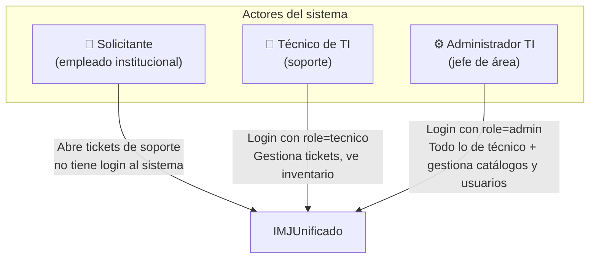
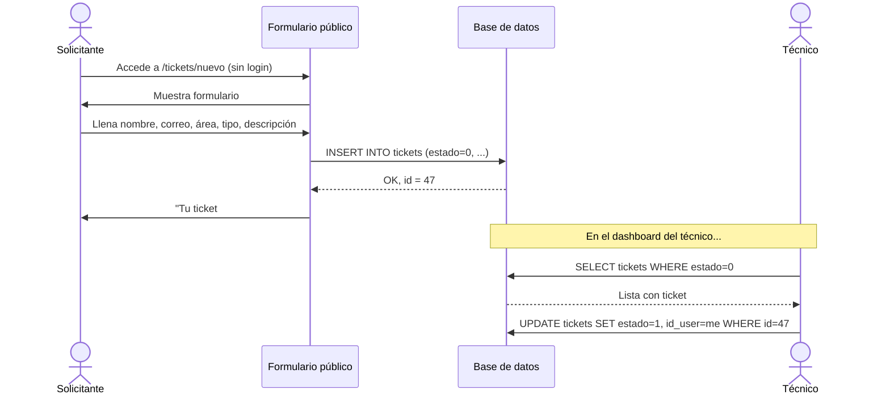
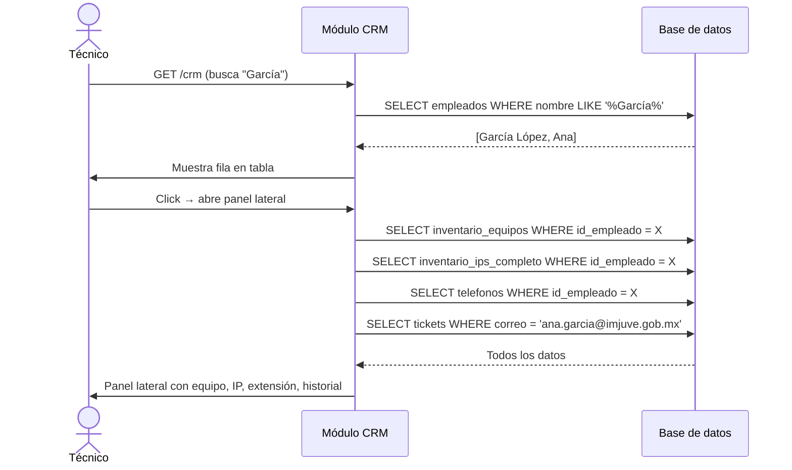
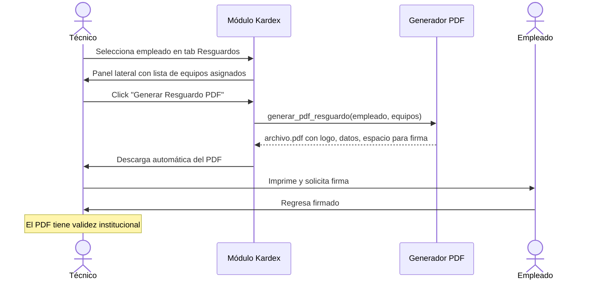
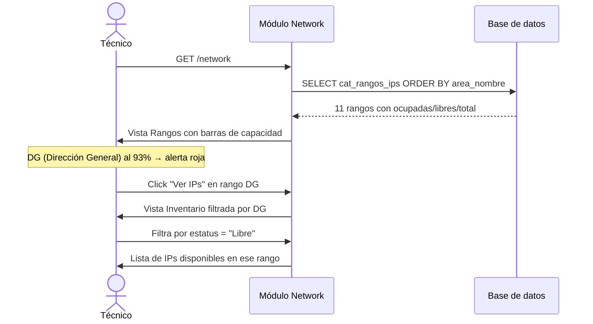

# Decisiones de Diseño — Usuarios, Historias de Usuario y Casos de Uso

---

## Tipos de usuario del sistema

El sistema tiene tres perfiles con necesidades completamente distintas:

### Solicitante (empleado institucional)
- **Quién es:** cualquier persona que trabaja en el instituto con un problema de TI
- **Acceso al sistema:** ninguno — solo llena el formulario público de tickets
- **Qué puede hacer:** crear un ticket de soporte describiendo su problema
- **Lo que espera:** que alguien lo contacte y resuelva su problema

### Técnico de TI
- **Quién es:** el personal de la subdirección de sistemas que da soporte
- **Acceso al sistema:** login con `role = 'tecnico'`
- **Qué puede hacer:**
  - Ver y atender tickets
  - Consultar inventario de equipos, IPs, insumos
  - Ver el perfil de un empleado (qué equipo tiene, qué IP, qué extensión)
  - Generar resguardos PDF
- **Lo que NO puede hacer:** crear usuarios del sistema, editar catálogos

### Administrador de TI
- **Quién es:** el jefe o responsable de la subdirección de sistemas
- **Acceso al sistema:** login con `role = 'admin'`
- **Qué puede hacer:** todo lo del técnico, más:
  - Crear y gestionar cuentas de técnicos
  - Editar catálogos de Áreas y Tipos de incidentes
  - Ver reportes completos del sistema
  - Dar altas y bajas de empleados en el directorio

---

## Historias de usuario

Formato: *Como [rol], quiero [acción] para [beneficio].*

### Módulo Tickets

| ID | Historia | Prioridad |
|---|---|---|
| T-01 | Como **solicitante**, quiero describir mi problema en un formulario sin necesitar contraseña para poder pedir ayuda rápidamente | Alta |
| T-02 | Como **técnico**, quiero ver todos los tickets abiertos en un tablero Kanban para priorizar mi trabajo de un vistazo | Alta |
| T-03 | Como **técnico**, quiero tomar un ticket y marcarlo como "Atendiendo" para que el administrador sepa que está siendo manejado | Alta |
| T-04 | Como **técnico**, quiero cerrar un ticket cuando se resolvió para mantener el conteo actualizado | Alta |
| T-05 | Como **administrador**, quiero ver el historial completo de tickets de un empleado para evaluar qué problemas tiene recurrentemente | Media |
| T-06 | Como **administrador**, quiero gestionar los catálogos de Áreas y Tipos para que los tickets se clasifiquen correctamente | Media |

### Módulo CRM

| ID | Historia | Prioridad |
|---|---|---|
| C-01 | Como **técnico**, quiero buscar a un empleado por nombre para encontrar su información sin navegar toda la lista | Alta |
| C-02 | Como **técnico**, quiero ver de un clic qué equipo tiene asignado un empleado, su IP y su extensión telefónica | Alta |
| C-03 | Como **administrador**, quiero dar de alta a un empleado nuevo con sus datos para que aparezca en el directorio institucional | Alta |
| C-04 | Como **administrador**, quiero dar de baja a un empleado para que deje de aparecer como activo sin borrar su historial | Media |

### Módulo Kardex

| ID | Historia | Prioridad |
|---|---|---|
| K-01 | Como **técnico**, quiero ver qué equipos están en almacén (sin asignar) para poder asignarlos cuando llegue un empleado nuevo | Alta |
| K-02 | Como **técnico**, quiero generar el resguardo PDF de un equipo para que el empleado lo firme y quede registro oficial | Alta |
| K-03 | Como **técnico**, quiero ver qué insumos están en stock crítico para solicitar reposición a tiempo | Alta |
| K-04 | Como **técnico**, quiero registrar una entrega de toner a un área para que el stock se actualice automáticamente | Media |
| K-05 | Como **administrador**, quiero ver qué empleados tienen activos asignados para auditar el inventario | Alta |

### Módulo Network

| ID | Historia | Prioridad |
|---|---|---|
| N-01 | Como **técnico**, quiero ver el nivel de uso de cada rango de IPs para saber cuáles están cerca de llenarse | Alta |
| N-02 | Como **técnico**, quiero buscar una IP específica para ver a qué equipo y usuario corresponde | Alta |
| N-03 | Como **técnico**, quiero filtrar las IPs por área para trabajar solo con las de la dirección que me interesa | Media |
| N-04 | Como **técnico**, quiero ver los permisos de acceso a internet configurados para cada IP | Media |

---

## Casos de uso detallados

### CU-01: Abrir un ticket de soporte

### CU-02: Consultar perfil de empleado

### CU-03: Generar resguardo de equipo

### CU-04: Revisar disponibilidad de IPs

---

## Decisiones técnicas y de negocio

### Por qué fusionar `empleados` y `usuarios`

En el sistema original había dos tablas casi idénticas:
- `usuarios` en el sistema de inventario (nombre, área, extensión)
- `empleados` en IMJTickets (nombre, correo, para validar quién puede abrir tickets)

Un técnico veía en el inventario "Ana García, DBEJ" y en tickets "Ana García, ana.garcia@imjuve.gob.mx" — eran la misma persona, pero en dos tablas sin conexión. Esto hacía imposible mostrar en el panel de tickets qué equipo tenía Ana o viceversa.

**Decisión:** fusionar en una sola tabla `empleados` con todos los campos de ambas.

### Por qué los permisos de internet van como columnas y no como JSON

La tabla `inventario_ips_completo` tiene una columna por cada servicio (youtube, facebook, tiktok, etc.). La alternativa habría sido un campo JSON.

**Decisión:** columnas individuales porque:
1. Los filtros del inventario necesitan hacer queries por permiso específico (`WHERE youtube = 'SI'`)
2. El Excel original tenía una columna por servicio — mantener esa estructura simplifica el seeder
3. Los servicios que se monitorean son fijos y cambian raramente

### Por qué SQLite en desarrollo y MySQL en producción

El servidor Windows tiene XAMPP con MySQL. En máquinas de desarrollo (laptops de becarios con cualquier SO) instalar MySQL agrega fricción innecesaria. SQLite no requiere instalación — es solo un archivo.

**Decisión:** `.env.example` viene con SQLite. El `.env` de producción se configura con MySQL. El código de Laravel no cambia entre ambos.

### Por qué los FK `id_empleado` se poblan en `app:boot` y no en la migración

La migración `2026_07_09_000002` vincula equipos con empleados e IPs mediante PHP (`mb_strtolower`/`str_contains`) y subqueries SQLite. El problema es que esta lógica depende de que los datos ya estén importados. Si corre como parte del `migrate` normal (tablas vacías), no vincula nada.

**Decisión:** la lógica de vinculación vive en dos lugares:
1. Como migración `2026_07_09_000002` — para que quede en el historial de git y sea reversible.
2. Como método `vincularRelaciones()` en `FirstBootCommand` — para que se ejecute siempre después de importar datos.

En un fresh install, la migración corre sobre tablas vacías (hace 0 cambios). Luego `app:boot` importa los datos e invoca directamente la misma lógica de vinculación. Resultado: la BD queda correctamente vinculada al terminar `app:boot`.

### Por qué la IP real de un equipo viene de `inventario_ips_completo` y no de `inventario_equipos.ipv4`

En el dump original (`sistemitas.sql`), `inventario_equipos.ipv4` estaba vacío para casi todos los registros. La IP real de cada equipo estaba en `inventario_ips_completo.ip`, asociada por el campo `serie` (número de serie del equipo).

El join correcto es `LOWER(TRIM(inventario_ips_completo.serie)) = LOWER(TRIM(inventario_equipos.cpu_serie))`. El LOWER/TRIM es necesario por inconsistencias en el Excel original.

**Decisión:** se hizo un UPDATE masivo para poblar `inventario_equipos.ipv4` con los 19 registros que tienen match de serie. Adicionalmente, los endpoints de CRM y Kardex hacen un COALESCE en tiempo de consulta (`ipv4_real`) para capturar cualquier match futuro sin necesidad de otro UPDATE.

### Por qué NO se usa Gemini API (ni ningún LLM) para leer PDFs escaneados

La idea inicial era usar Gemini para hacer OCR en PDFs sin texto nativo. Se descartó porque:
1. Requiere clave de API externa (dependencia de servicio de terceros)
2. Introduce latencia y posibles costos
3. Los técnicos revisan los datos antes de guardar de todas formas — el OCR automático solo ahorraría tiempo, pero el riesgo de error es el mismo

**Decisión:** solo `smalot/pdfparser` para PDFs con texto nativo. Si el PDF es escaneado (imagen), se muestra un formulario vacío con un banner amarillo explicando que el técnico debe capturar los datos manualmente. El PDF siempre se guarda como adjunto independientemente del tipo.

### Por qué se eliminaron los módulos Telefonos e Impresoras

Ambos módulos fueron creados como scaffolding vacío con nwidart pero nunca se implementaron. Sus controladores tenían todos los métodos sin cuerpo y sus rutas solo devolvían una vista de placeholder sin datos.

Las tablas `telefonos` e `impresoras` siguen existiendo y son gestionadas desde:
- `telefonos` → accesible desde el panel lateral del empleado en CRM
- `impresoras` → migración en `Modules/Kardex/database/migrations/`; teléfonos y tabletas se manejarán como un `tipo` más en `inventario_equipos` dentro de Kardex

**Decisión:** eliminar los módulos vacíos reduce la superficie de código muerto y evita confusión en becarios que asuman que esas rutas tienen funcionalidad real.

El módulo `Mantenimiento` sigue existiendo como stub porque su alcance aún no está definido — requiere reunión con el cliente antes de implementarlo.
