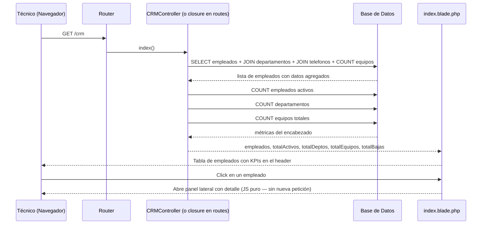

# Módulo CRM — Directorio de Empleados

**Ruta base:** `/crm`  
**Estado:** ✅ Vista funcional — CRUD pendiente

---

## ¿Qué hace este módulo?

Es el directorio de personal del instituto. Muestra todos los empleados con su departamento, extensión telefónica y cantidad de equipos asignados. Desde aquí un técnico puede consultar rápidamente quién tiene qué equipo, a qué área pertenece y cómo contactarlo.

El panel lateral (derecho) permite ver el detalle completo de un empleado: sus activos, historial de tickets y datos de contacto.

---

## Archivos del módulo

```
Modules/CRM/
├── app/
│   └── Http/Controllers/
│       └── CRMController.php    ← lógica (actualmente vacío — ver deuda técnica)
├── resources/views/
│   └── index.blade.php          ← tabla de empleados + panel lateral
└── routes/
    └── web.php                  ← ⚠️ tiene queries en el archivo de rutas (ver convenciones.md)
```

---

## Tablas de base de datos

| Tabla | Propósito |
|---|---|
| `empleados` | Directorio de personal activo e inactivo |
| `departamentos` | Catálogo de áreas/direcciones del instituto |
| `telefonos` | Extensiones telefónicas por empleado |
| `inventario_equipos` | Equipos asignados (JOIN para contar cuántos tiene cada quien) |

### Esquema de `empleados`

| Columna | Tipo | Descripción |
|---|---|---|
| `id_empleado` | entero auto | Identificador único |
| `nombre` | texto | Primer nombre |
| `apellido_paterno` | texto | Apellido paterno |
| `apellido_materno` | texto | Apellido materno |
| `puesto` | texto | Puesto o cargo |
| `correo` | texto | Correo institucional (también usado en tickets) |
| `id_departamento` | entero FK | Referencia a `departamentos` |
| `activo` | booleano | `true`=activo, `false`=baja |
| `fecha_alta` | fecha | Cuándo se dio de alta |
| `fecha_baja` | fecha | Cuándo se dio de baja (null si activo) |

---

## Rutas

```
GET /crm   → CRMController@index   (solo auth)
```

> **Deuda técnica:** actualmente la query está en `routes/web.php` en un closure. Debe moverse a `CRMController@index`. Ver [convenciones.md](convenciones.md).

---

## Diagrama de Secuencia — Consultar directorio



---

## La consulta principal explicada

Esta es la query que trae los datos de la tabla. Está en `routes/web.php` (deuda técnica — debería estar en el controlador):

```php
$empleados = DB::table('empleados')
    // Une la tabla de departamentos para obtener el nombre del depa
    ->leftJoin('departamentos', 'empleados.id_departamento', '=', 'departamentos.id_departamento')
    // Une teléfonos para obtener la extensión
    ->leftJoin('telefonos', 'empleados.id_empleado', '=', 'telefonos.id_empleado')
    // Une equipos para contar cuántos tiene asignados
    ->leftJoin('inventario_equipos', 'empleados.id_empleado', '=', 'inventario_equipos.id_empleado')
    ->select(
        'empleados.*',                           // todos los campos del empleado
        'departamentos.nombre as departamento_nombre',  // nombre del departamento
        'telefonos.extension',                   // extensión telefónica
        DB::raw('COUNT(inventario_equipos.id) as total_equipos')  // conteo de equipos
    )
    ->groupBy('empleados.id_empleado', 'departamentos.nombre', 'telefonos.extension')
    ->orderBy('empleados.nombre')
    ->get();
```

`leftJoin` significa "une esta tabla, y si no hay coincidencia, pon `null` en esos campos". Es útil aquí porque un empleado puede no tener teléfono ni equipo asignado — con `leftJoin` igual aparece en la lista, con `extension = null` y `total_equipos = 0`.

---

## Panel lateral — cómo funciona

El panel lateral es JavaScript puro. No hace peticiones al servidor — los datos ya están en el HTML cargado inicialmente.

```javascript
// Cuando haces click en un empleado, JavaScript lee los atributos data-*
// que están en el HTML de cada fila de la tabla y los inyecta en el panel
function openEmployeePanel(id, nombre, correo, depa) {
    document.getElementById('panel-nombre').innerText = nombre;
    document.getElementById('panel-correo').innerText = correo;
    // ... etc
    document.getElementById('employee-panel').classList.remove('closed');
}
```

Los datos de los tabs "Recursos", "Historial" y "Tickets" son **placeholder actualmente** — se necesita conectar con peticiones reales (AJAX o Livewire) para cargar los datos de cada empleado al seleccionarlo.

---

## Pendiente / Lo que falta

- [ ] Mover la query de `routes/web.php` a `CRMController@index`
- [ ] Conectar tabs del panel lateral con datos reales (equipos, tickets del empleado)
- [ ] Formulario de alta de nuevo empleado
- [ ] Formulario de baja (marcar `activo = false`)
- [ ] Formulario de edición de datos del empleado
- [ ] Buscar empleado por nombre (el input de búsqueda ya existe en la UI, falta conectarlo)
