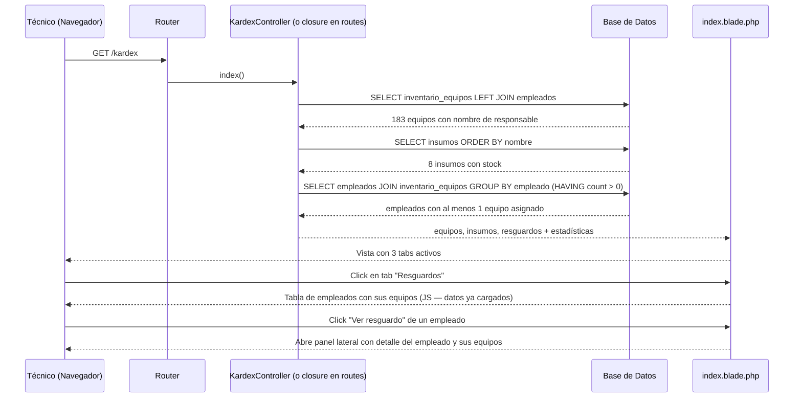
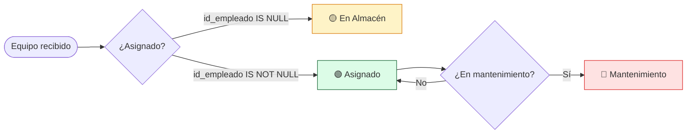

# Módulo Kardex — Inventario de Equipos e Insumos

**Ruta base:** `/kardex`  
**Estado:** ✅ Vista funcional — operaciones de escritura pendientes

---

## ¿Qué hace este módulo?

Maneja el inventario físico del departamento de TI. Tiene tres secciones (tabs):

1. **Equipos** — inventario de laptops, PCs y equipos especializados con su responsable asignado
2. **Insumos** — stock de consumibles (tóner, cartuchos, cables, etc.)
3. **Resguardos** — qué equipos tiene asignado cada empleado (para generar el documento de resguardo oficial)

---

## Archivos del módulo

```
Modules/Kardex/
├── app/
│   └── Http/Controllers/
│       └── KardexController.php    ← actualmente vacío (deuda técnica)
├── resources/views/
│   └── index.blade.php             ← tres tabs: Equipos, Insumos, Resguardos
└── routes/
    └── web.php                     ← ⚠️ queries en el archivo de rutas (deuda técnica)
```

---

## Tablas de base de datos

| Tabla | Propósito |
|---|---|
| `inventario_equipos` | Un registro por equipo físico |
| `insumos` | Stock de consumibles |
| `empleados` | Para relacionar equipo ↔ responsable |

### Esquema de `inventario_equipos`

| Columna | Tipo | Descripción |
|---|---|---|
| `id` | entero auto | Identificador único |
| `tipo` | texto | `'Laptop'`, `'PC Avanzada'`, `'PC Especializada'` |
| `consecutivo` | entero | Número de inventario institucional |
| `num_inventario` | texto | Código completo ej: `LAP-001` |
| `nombre_equipo` | texto | Marca y modelo ej: `Dell Latitude 5420` |
| `id_empleado` | entero FK | Referencia a `empleados` (null = en almacén) |
| `num_serie` | texto | Número de serie del fabricante |
| `procesador` | texto | Especificación del CPU |
| `ram` | texto | Memoria RAM |
| `almacenamiento` | texto | Disco duro/SSD |

### Esquema de `insumos`

| Columna | Tipo | Descripción |
|---|---|---|
| `id` | entero auto | Identificador único |
| `numero_parte` | texto | Código del fabricante |
| `nombre_insumo` | texto | Descripción del consumible |
| `stock_actual` | entero | Cantidad disponible en almacén |
| `stock_minimo` | entero | Cantidad mínima antes de alertar |

---

## Rutas

```
GET /kardex   → KardexController@index   (solo auth)
```

> **Deuda técnica:** la query está en `routes/web.php`. Debe moverse a `KardexController@index`.

---

## Diagrama de Secuencia — Cargar el Kardex



---

## Lógica de estados de equipos



> **Nota:** el estado "Mantenimiento" aún no está implementado en la base de datos. Actualmente el conteo de mantenimiento es hardcodeado en `0`. Se necesita agregar una columna `en_mantenimiento` booleana o una tabla `reportes_mantenimiento`.

---

## Cómo se determina si un equipo está "en almacén"

```php
// En la query, si id_empleado es null, el equipo no tiene responsable = está en almacén
$enAlmacen = $equipos->whereNull('id_empleado')->count();
```

En la vista, cada fila muestra el badge correspondiente:
```blade
@if($eq->id_empleado)
    <span class="bg-green-100 text-green-800 ...">Asignado</span>
@else
    <span class="bg-yellow-100 text-yellow-800 ...">Almacén</span>
@endif
```

---

## Stock crítico de insumos

Un insumo es "crítico" cuando `stock_actual <= 2`. La lógica está en el controlador:

```php
$criticos = $insumos->where('stock_actual', '<=', 2)->count();
```

Actualmente el umbral está hardcodeado en `2`. A futuro debería compararse contra `insumos.stock_minimo`.

---

## Pendiente / Lo que falta

- [ ] Mover queries de `routes/web.php` a `KardexController@index`
- [ ] Generar PDF de resguardo (la función ya existe en el sistema Python — hay que portarla a `barryvdh/laravel-dompdf`)
- [ ] Asignar / desasignar equipo a empleado (formulario)
- [ ] Dar de alta nuevo equipo
- [ ] Registrar entrada/salida de insumos (tabla `suministros` ya existe)
- [ ] Implementar estado "En mantenimiento" correctamente
- [ ] Usar `stock_minimo` de la BD para alertas de stock crítico
