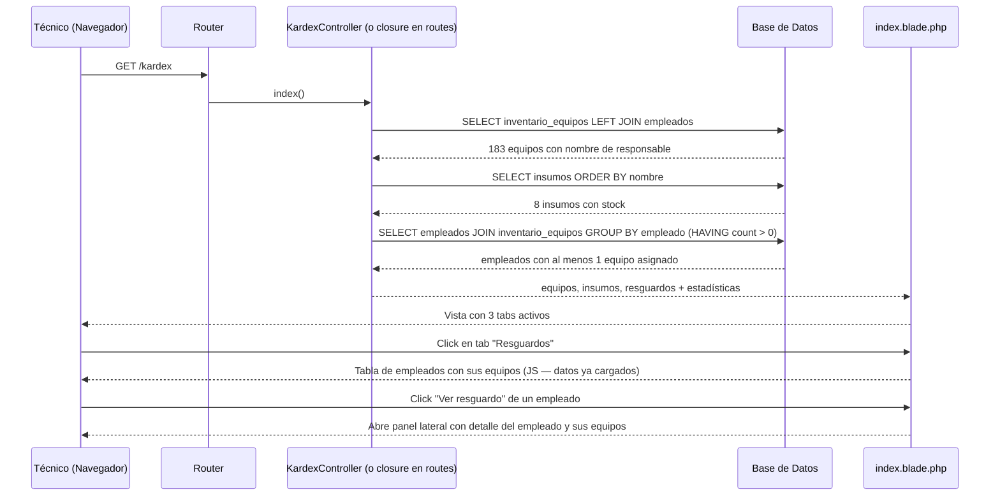
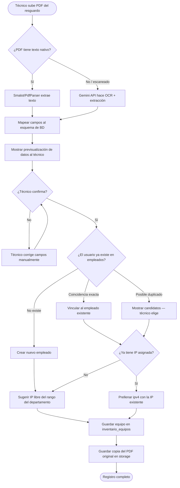

# Módulo Kardex — Inventario de Equipos e Insumos

**Ruta base:** `/kardex`  
**Estado:** ✅ Vista funcional — operaciones de escritura pendientes

---

## ¿Qué hace este módulo?

Maneja el inventario físico del departamento de TI. Tiene tres secciones (tabs):

1. **Equipos** — inventario de laptops, PCs y equipos especializados con su responsable asignado
2. **Insumos** — stock de consumibles (tóner, cartuchos, cables, etc.)
3. **Resguardos** — qué equipos tiene asignado cada empleado (para generar el documento de resguardo oficial)

---

## Archivos del módulo

```
Modules/Kardex/
├── app/
│   └── Http/Controllers/
│       └── KardexController.php    ← actualmente vacío (deuda técnica)
├── resources/views/
│   └── index.blade.php             ← tres tabs: Equipos, Insumos, Resguardos
└── routes/
    └── web.php                     ← ⚠️ queries en el archivo de rutas (deuda técnica)
```

---

## Tablas de base de datos

| Tabla | Propósito |
|---|---|
| `inventario_equipos` | Un registro por equipo físico |
| `insumos` | Stock de consumibles |
| `empleados` | Para relacionar equipo ↔ responsable |

### Esquema de `inventario_equipos`

| Columna | Tipo | Descripción |
|---|---|---|
| `id` | entero auto | Identificador único |
| `tipo` | texto | `'Laptop'`, `'PC Avanzada'`, `'PC Especializada'` |
| `consecutivo` | entero | Número de inventario institucional |
| `num_inventario` | texto | Código completo ej: `LAP-001` |
| `nombre_equipo` | texto | Marca y modelo ej: `Dell Latitude 5420` |
| `id_empleado` | entero FK | Referencia a `empleados` (null = en almacén) |
| `num_serie` | texto | Número de serie del fabricante |
| `procesador` | texto | Especificación del CPU |
| `ram` | texto | Memoria RAM |
| `almacenamiento` | texto | Disco duro/SSD |

### Esquema de `insumos`

| Columna | Tipo | Descripción |
|---|---|---|
| `id` | entero auto | Identificador único |
| `numero_parte` | texto | Código del fabricante |
| `nombre_insumo` | texto | Descripción del consumible |
| `stock_actual` | entero | Cantidad disponible en almacén |
| `stock_minimo` | entero | Cantidad mínima antes de alertar |

---

## Rutas

```
GET /kardex   → KardexController@index   (solo auth)
```

> **Deuda técnica:** la query está en `routes/web.php`. Debe moverse a `KardexController@index`.

---

## Diagrama de Secuencia — Cargar el Kardex



---

## Lógica de estados de equipos


> **Nota:** el estado "Mantenimiento" aún no está implementado en la base de datos. Actualmente el conteo de mantenimiento es hardcodeado en `0`. Se necesita agregar una columna `en_mantenimiento` booleana o una tabla `reportes_mantenimiento`.

---

## Cómo se determina si un equipo está "en almacén"

```php
// En la query, si id_empleado es null, el equipo no tiene responsable = está en almacén
$enAlmacen = $equipos->whereNull('id_empleado')->count();
```

En la vista, cada fila muestra el badge correspondiente:
```blade
@if($eq->id_empleado)
    <span class="bg-green-100 text-green-800 ...">Asignado</span>
@else
    <span class="bg-yellow-100 text-yellow-800 ...">Almacén</span>
@endif
```

---

## Stock crítico de insumos

Un insumo es "crítico" cuando `stock_actual <= 2`. La lógica está en el controlador:

```php
$criticos = $insumos->where('stock_actual', '<=', 2)->count();
```

Actualmente el umbral está hardcodeado en `2`. A futuro debería compararse contra `insumos.stock_minimo`.

---

## Pendiente / Lo que falta

- [ ] Mover queries de `routes/web.php` a `KardexController@index`
- [ ] Generar PDF de resguardo (la función ya existe en el sistema Python — hay que portarla a `barryvdh/laravel-dompdf`)
- [ ] Asignar / desasignar equipo a empleado (formulario)
- [ ] Dar de alta nuevo equipo
- [ ] Registrar entrada/salida de insumos (tabla `suministros` ya existe)
- [ ] Implementar estado "En mantenimiento" correctamente
- [ ] Usar `stock_minimo` de la BD para alertas de stock crítico
- [ ] **Implementar ingesta de resguardo por PDF** (ver regla de negocio abajo)

---

## Regla de Negocio — El Resguardo como fuente primaria de registro

### Contexto

Cuando el departamento de TI recibe un equipo de cómputo (ya sea nuevo, reasignado o de mantenimiento), el proveedor o el área administrativa entrega un documento físico o digital llamado **resguardo** o **reporte de servicio**. Este documento es la fuente oficial de verdad: contiene quién es responsable del equipo, qué periféricos incluye y sus números de serie.

**El sistema debe tomar este documento como punto de entrada preferido** para registrar tanto al usuario como al equipo, en lugar de que el técnico capture los datos a mano campo por campo.

Ejemplo de documento real manejado en IMJUVE (proveedor ECLECSIS):

```
REPORTE DE SERVICIO DE ATENCIÓN, MANTENIMIENTO PREVENTIVO Y CORRECTIVOS
Contrato: IMJ-ITP-018-2021-CM-006
Usuario:  Ernesto Uriel Jarquín Garnett
Equipo:   Laptop / DELL / Latitude 3420
Serie:    33KGW93
Inv:      65
```

---

### Flujo de registro vía PDF



---

### Campos capturados por tipo de equipo

No todos los tipos de equipo tienen los mismos periféricos. El sistema solo guarda los campos que aplican:

| Campo | Laptop | PC Avanzada | PC Especializada |
|---|:---:|:---:|:---:|
| `cpu_marca` / `cpu_modelo` / `cpu_serie` | ✅ | ✅ | ✅ |
| `cargador_serie` | ✅ | ❌ | ❌ |
| `docking_marca` / `docking_serie` | opcional | ❌ | ❌ |
| `monitor_marca` / `monitor_modelo` / `monitor_serie` | ❌ | ✅ | ✅ |
| `teclado_serie` | ❌ | ✅ | ✅ |
| `mouse_serie` | ❌ | ✅ | ✅ |
| `nobreak_marca` / `nobreak_serie` | ❌ | ✅ | ✅ |
| `ipv4` / `mac` | ✅ | ✅ | ✅ |
| `observaciones` | ✅ | ✅ | ✅ |

> El número de serie (`cpu_serie`) es el único campo obligatorio en todos los tipos. Los demás dependen del tipo.

---

### Detección de duplicados de usuario

Antes de crear un empleado nuevo, el sistema busca coincidencias en la tabla `empleados`:

1. **Exacta por correo** — si el PDF trae correo y coincide con `empleados.correo`, se vincula directo
2. **Por nombre completo** — si `nombre + apellido_paterno` coincide al 90%+ (fuzzy match), se muestra como candidato
3. **Sin coincidencia** — se crea un nuevo empleado con los datos del PDF; el correo se genera con la lógica `test` (`nombre.apellidotest@imjuventud.gob.mx`) hasta que se confirme el correo real

---

### Asignación de IP

| Condición | Acción |
|---|---|
| El usuario ya tiene un equipo en `inventario_equipos` con `ipv4` asignada | Se prellenan `ipv4` e `ipv4_actual` con ese valor |
| El usuario es nuevo o no tiene IP | Se consulta `cat_rangos_ips` filtrando por el `area`/departamento del empleado y se sugiere la primera IP libre |
| No hay rangos disponibles para esa área | Se deja en blanco y se marca para asignación manual |

---

### Requisito de calidad del PDF

El sistema da prioridad a PDFs con texto nativo (tipado) porque la extracción es exacta y no requiere servicios externos. El técnico debe ser informado de esto al subir el archivo:

- ✅ **PDF tipado** (texto seleccionable) → extracción inmediata con `Smalot/PdfParser`
- ⚠️ **PDF escaneado** (imagen) → se envía a Gemini API; puede haber errores en caracteres ambiguos — revisar antes de confirmar
- ❌ **Foto del documento** (`.jpg`, `.png`) → se acepta como fallback pero la precisión depende de la calidad de la imagen

El mensaje al técnico cuando se detecta un PDF-imagen:

> "Este archivo parece ser una imagen escaneada. Los datos fueron extraídos mediante reconocimiento óptico — revisa cada campo antes de guardar, especialmente los números de serie."

---

### Tecnología a implementar

| Tarea | Librería / Servicio |
|---|---|
| Leer PDF con texto nativo | `smalot/pdfparser` (instalar con `composer require smalot/pdfparser`) |
| OCR en PDF escaneado o imagen | Gemini API (`gemini-1.5-flash`) vía `Http::post()` de Laravel |
| Detectar si el PDF tiene texto | `$pdf->getText()` vacío → tratar como imagen |
| Guardar copia del PDF original | `Storage::put('resguardos/{id_equipo}.pdf', $file)` |
| Prompt a Gemini | JSON estricto con los campos del esquema; `responseMimeType: application/json` para evitar texto libre |

> La API key de Gemini va en `.env` como `GEMINI_API_KEY`. No subir al repositorio.
