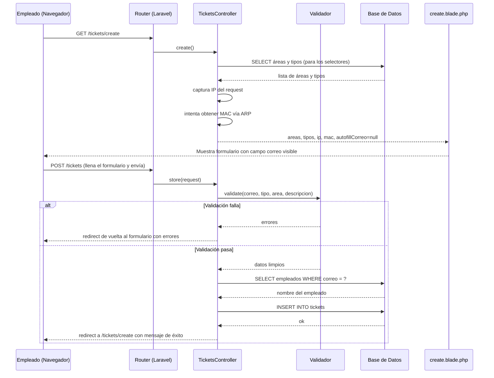
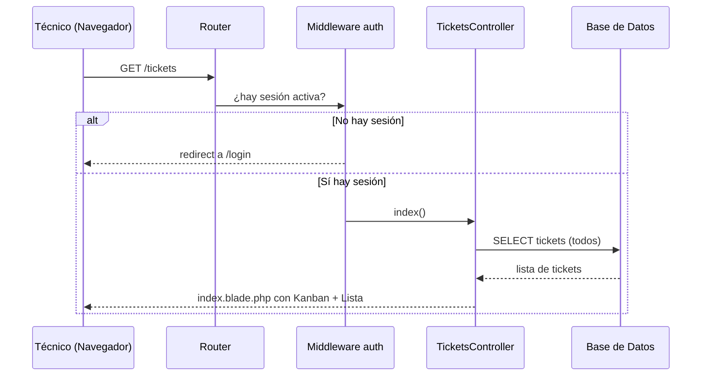
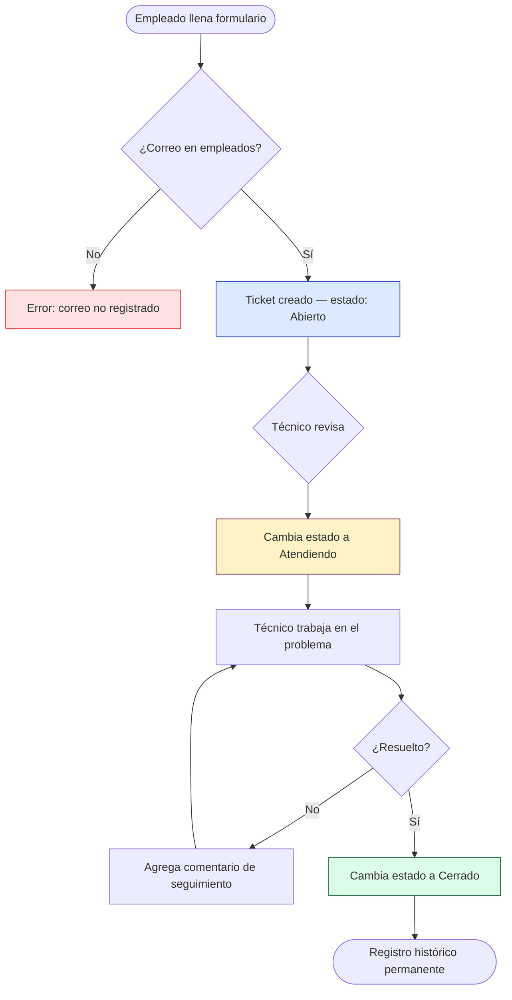

# Módulo Tickets

**Ruta base:** `/tickets`  
**Estado:** ✅ Funcional — formulario público + vista de gestión

---

## ¿Qué hace este módulo?

Gestiona el ciclo de vida de las solicitudes de soporte técnico. Tiene dos caras:

- **Pública** (`/tickets/create`): Cualquier empleado puede abrir un ticket sin login. Solo necesita su correo institucional.
- **Interna** (`/tickets`): Solo personal de TI autenticado puede ver y gestionar los tickets (cambiar estado, comentar, etc.).

---

## Archivos del módulo

```
Modules/Tickets/
├── app/
│   ├── Http/Controllers/
│   │   └── TicketsController.php   ← toda la lógica
│   └── Models/
│       └── Ticket.php              ← representa un ticket en la BD
├── database/
│   ├── migrations/
│   │   └── 2025_01_01_000010_create_tickets_table.php
│   └── seeders/
│       └── TicketsCatalogoSeeder.php  ← carga áreas y tipos
├── resources/views/
│   ├── index.blade.php             ← vista de gestión (Kanban + lista)
│   ├── create.blade.php            ← formulario público
│   └── create-internal.blade.php  ← formulario con sidebar (logueado)
└── routes/
    └── web.php
```

---

## Tablas de base de datos

| Tabla | Propósito |
|---|---|
| `tickets` | Un registro por solicitud de soporte |
| `areas` | Catálogo de áreas institucionales (18 registros) |
| `tipos` | Catálogo de tipos de incidente (10 registros) |

### Esquema de `tickets`

| Columna | Tipo | Descripción |
|---|---|---|
| `id` | entero auto | Identificador único |
| `nombre` | texto | Nombre del solicitante (resuelto de `empleados`) |
| `correo` | texto | Correo del solicitante |
| `ip` | texto | IP capturada al enviar el formulario |
| `mac` | texto | Dirección MAC (solo si están en la misma red) |
| `area` | texto | Nombre del área (de catálogo `areas`) |
| `tipo` | texto | Tipo de incidente (de catálogo `tipos`) |
| `descripcion` | texto | Descripción del problema |
| `estado` | entero | `0`=Abierto `1`=Atendiendo `2`=Cerrado |
| `comentarios` | texto | Notas del técnico |
| `atendido_at` | fecha | Cuándo pasó a "Atendiendo" |
| `atendido_by` | texto | Email del técnico que lo tomó |
| `cerrado_at` | fecha | Cuándo se cerró |
| `cerrado_by` | texto | Email del técnico que lo cerró |

---

## Rutas

```
GET  /tickets/create   → TicketsController@create   (pública, sin auth)
POST /tickets          → TicketsController@store    (pública, sin auth)
GET  /tickets          → TicketsController@index    (solo auth)
```

---

## Flujo completo — Diagrama de Secuencia

### Empleado abre un ticket (sin login)



### Técnico gestiona un ticket (con login)



---

## Ciclo de vida de un ticket



---

## Cómo agregar una nueva función a este módulo

### Ejemplo: agregar comentarios del técnico

**Paso 1** — Agregar la ruta en `routes/web.php`:
```php
Route::middleware(['auth'])->group(function () {
    Route::post('/tickets/{id}/comentar', [TicketsController::class, 'comentar'])->name('tickets.comentar');
});
```

**Paso 2** — Agregar el método en `TicketsController.php`:
```php
public function comentar(Request $request, int $id)
{
    $request->validate(['comentarios' => 'required|string']);
    
    DB::table('tickets')
        ->where('id', $id)
        ->update(['comentarios' => $request->comentarios]);
    
    return back()->with('success', 'Comentario guardado.');
}
```

**Paso 3** — Agregar el formulario en la vista donde corresponda.

---

## Pendiente / Lo que falta

- [ ] Mostrar tickets reales en el Kanban (actualmente son placeholder)
- [ ] Mostrar tickets reales en la vista Lista
- [ ] Panel lateral de detalle del ticket con info completa
- [ ] Cambiar estado desde el panel (Abierto → Atendiendo → Cerrado)
- [ ] Mostrar IP y MAC en el detalle del ticket (solo visible para admin)
- [ ] Filtros por estado, área, tipo en la vista Lista
